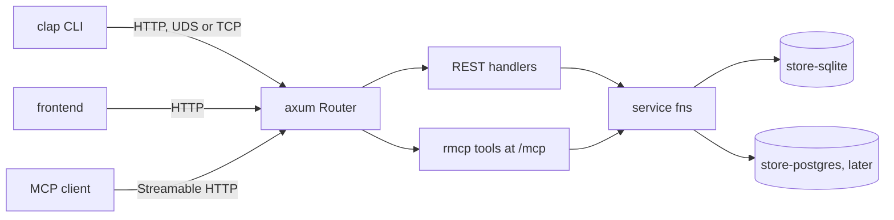

# sc-runtime Architecture

**ID Range:** ADR-RUN-0001 through ADR-RUN-0401  
**Status:** Draft  
**Created:** 2026-09-19  
**Last Updated:** 2026-09-19  
**Owner:** sc-runtime maintainers  

---

Repo-level architecture and ADRs for `sc-runtime`, extracted from
[`sc-runtime-design.md`](sc-runtime-design.md). Requirements are in
[`requirements.md`](requirements.md). Crate-level architecture and ADRs live in
`docs/<crate>/architecture.md`:
[sc-config](sc-config/architecture.md),
[sc-transport](sc-transport/architecture.md),
[sc-command](sc-command/architecture.md),
[sc-runtime](sc-runtime/architecture.md).

ADR entries follow the shared SC format in
the shared SC requirement and ADR templates.

## System shape

`sc-runtime` produces two kinds of thing: four library crates that are
published and versioned, and a template that is rendered once into a project
and then belongs to that project.

| Layer | What it holds | Owner | Lives in |
|---|---|---|---|
| Standalone crates | config loading; listener and client connector; response envelope | this repo, published | `crates/sc-config`, `crates/sc-transport`, `crates/sc-command` |
| Assembly crate | singleton lock, router merge, serve, graceful shutdown, test fixture | this repo, published | `crates/sc-runtime` |
| Application layer | operations, routes, MCP tools, CLI commands, stores, schemas | the generated project | rendered from `template/` |
| Generation tooling | options contract, fixtures, driver, wizard | this repo, not published | `wizard/`, `scripts/`, `tests/unit/` |

The dividing rule is upgradeability: generated code cannot be upgraded after
birth, a dependency can. So anything that should improve across all projects is
in a crate, and anything a project will want to edit is in the template.

## Runtime architecture

One daemon process owns the stores, and every client reaches it over HTTP
through one Axum router. REST handlers and MCP tools are both thin: each
deserialises into an `api-types` struct and calls the same async service
function, which is the only code path to SQL.



Request path for one operation: the CLI posts `CreateWidget` JSON to
`/ops/widget.create`; the handler calls `service::create_widget(stores,
input)`; the service function runs a checked sqlx query in the store crate; the
`Result<Widget, OpError>` becomes an envelope on the way out. An MCP
`tools/call` for `widget_create` joins the same path at the service function,
with the same `CreateWidget` struct as its input schema.

Daemon start-up, performed by `sc_runtime::Daemon::builder()` in a fixed order:
take the config the project already loaded; resolve the instance root and take
the `daemon.lock` singleton; call the project's stores closure; merge the
project's router with the OpenAPI document route, a health route and the MCP
service; bind the listener through `sc-transport` and serve until SIGINT or
SIGTERM. The project's `main.rs` loads config with `sc-config` and initialises
`sc-observability` itself before calling the builder.

## Crate graph

```text
sc-config      -> serde, serde_json
sc-transport   -> tokio, reqwest            (+ axum behind `server`)
sc-command     -> serde, sc-observability-types   (+ axum, rmcp behind `server`)
sc-runtime     -> sc-config, sc-transport[server], sc-command[server],
                  axum, tokio, fd-lock
```

There is no edge among `sc-config`, `sc-transport` and `sc-command`.
`sc-runtime` is the only crate that knows the others. In a generated project,
`daemon` depends on `sc-runtime` and `sc-config`; `cli` depends on
`sc-transport`, `sc-command`, `sc-config` and `api-types`, all without the
`server` feature. Each crate's edges are recorded in
`boundaries/<crate>/*.toml` and enforced by `sc-lint-boundary`.

## Generation architecture

One answers JSON file drives generation. It comes from the Wyvern wizard, from
a wizard prefilled by an agent, or directly from `--var-file`. The driver
validates it against `wizard/answers.schema.json`, writes a `[values]` TOML
file, runs `cargo generate` on `template/`, runs `sc-compose` on the two
agent-facing Jinja documents, then runs `just lint` and `just test` in the new
project. Template CI runs the same driver over every fixture in
`wizard/fixtures/`.

---

## ADR-RUN-0001: The framework instantiates, the project wires

**Status:** Active  
**Decision Date:** 2026-09-19  
**Source:** design decisions 6, 10; amends SC scaffold decision record 013  

### Context

Earlier scaffold revisions planned a typed command registry: a
project would register commands once and the framework would generate REST,
MCP and CLI adapters from the registry. That puts the framework between the
project and Axum, rmcp and clap, which means wrapper types, a macro or
generator to maintain, and framework opinions about what a command is.

### Decision

Operations are shared async service functions written in project
code. REST handlers, MCP tools and CLI commands are three thin views of one
service function, each produced by the standard derive or macro of its own
library. `sc_runtime::Daemon::builder()` is the single assembly point that
SC scaffold decision record 013 called for, reduced to assembly only: it owns no registry and wraps
no Axum, rmcp or sqlx type. The project passes in an ordinary router and an
ordinary rmcp service and receives its own `Stores` value back untouched.

### Consequences

Which routes exist, which store a route uses and what data
moves where are entirely project decisions in ordinary Rust. Anything Axum,
rmcp or clap can do, a project can do, with those libraries' own documentation.
The cost is that nothing in these crates keeps the three surfaces in step;
that check belongs to sc-lint ([ADR-RUN-0005](architecture.md)).

### Alternatives Considered

A command registry with generated adapters; a macro system; a
portable abstraction over the three surfaces.

### Implementation

**Enforced by:** `arch-qa` review; [NFR-RUN-0003](requirements.md); `sc-runtime` boundary
manifest (no re-exported wrapper types).

### Related Documents

- [NFR-RUN-0003](requirements.md)
- [REQ-RUN-0201](requirements.md)
- [REQ-RT-0001](sc-runtime/requirements.md)
- [REQ-RT-0003](sc-runtime/requirements.md)

---

## ADR-RUN-0002: Thin template, versioned crates

**Status:** Active  
**Decision Date:** 2026-09-19  
**Source:** design decisions 11, 16; amends scaffold rev 4  

### Context

Rev 4 planned to start the reusable crates as path dependencies
copied into each generated project and extract them later. Code copied into a
project at generation time can never be upgraded, so every fix would have to be
re-applied by hand in every project.

### Decision

The four crates are built as separate workspace crates from the
start, published separately to crates.io, and named by version in generated
projects. Crates and template share one repository and workspace so template CI
tests against the crates at the same commit. Before first publish, and for
unreleased changes, `[patch.crates-io]` or a git tag stands in. The test for
where code goes is: should it improve across all projects (crate), or will a
project edit it (template)?

### Consequences

Generated projects upgrade with `cargo update`. The template
stays small, which keeps the fixture matrix cheap. Publishing becomes part of
the release, and crate APIs become public contracts with semver obligations
from v0.1.0. Any crate can move to its own repository later without an API
change.

### Alternatives Considered

Path dependencies copied into projects; one monolithic
`sc-runtime` crate; a repository per crate from day one (loses same-commit
template CI).

### Implementation

**Enforced by:** `req-qa` on [REQ-RUN-0003](requirements.md); the fixture matrix.

### Related Documents

- [REQ-RUN-0001](requirements.md)
- [REQ-RUN-0002](requirements.md)
- [REQ-RUN-0003](requirements.md)
- [REQ-RUN-0702](requirements.md)

---

## ADR-RUN-0201: The daemon is always running and everything speaks HTTP

**Status:** Active  
**Decision Date:** 2026-09-19  
**Source:** design decisions 1, 2, 3, 24; carries SC scaffold decision record 014  

### Context

A CLI that can open the database itself when no daemon is running
is convenient, and it creates a second writer to a SQLite file, a second code
path to SQL, and behaviour that differs depending on whether a daemon happens
to be up.

### Decision

The daemon is the only process that opens the local database and
holds a hard singleton: an OS exclusive lock on `<instance-root>/daemon.lock`.
Every client, including the project's own CLI, reaches it over HTTP. The CLI
has no direct-database mode. If the daemon is unreachable the CLI reports the
typed error `DAEMON.NOT_RUNNING` with a suggested action and does nothing else;
it does not start the daemon.

### Consequences

One code path to SQL and one writer. Every CLI command needs
a running daemon, so the error for its absence must be clear and actionable,
which is why it is typed. Whether the CLI may auto-start the daemon remains
open (decision 24); until decided, report-only is the behaviour and nothing may
assume otherwise. A shared Postgres store, when it arrives, may be written by
daemons on several hosts; the singleton governs the local store only.

### Alternatives Considered

A direct-database CLI fallback; PID files or port probing as the
singleton mechanism.

### Implementation

**Enforced by:** [NFR-RUN-0001](requirements.md) (the CLI cannot link sqlx); the
`DAEMON.NOT_RUNNING` test in [REQ-RUN-0202](requirements.md).

### Related Documents

- [REQ-RUN-0202](requirements.md)
- [REQ-RT-0002](sc-runtime/requirements.md)
- [REQ-TRN-0006](sc-transport/requirements.md)

---

## ADR-RUN-0003: Crate graph and the `server` feature

**Status:** Active  
**Decision Date:** 2026-09-19  
**Source:** design decision 11; "Repository layout"  

### Context

Two properties pull against each other. Each of `sc-config`,
`sc-transport` and `sc-command` must be usable alone, and both the daemon and
the CLI use `sc-transport` and `sc-command`. Yet the CLI must not link Axum,
rmcp or sqlx, and the server halves of those two crates need Axum and rmcp.

### Decision

`sc-config`, `sc-transport` and `sc-command` are standalone and
have no dependency edges among them. `sc-runtime` is the only crate that knows
the others. Server-side code in `sc-transport` (listener binding) and
`sc-command` (the axum response and rmcp tool-result conversions) sits behind a
`server` cargo feature that is off by default. `sc-runtime` enables those
features and is a dependency of the daemon only.

### Consequences

A CLI depends on the default builds and links none of the
server stack. Shared concepts cannot be shared by adding an edge: for example
`sc-transport` reports `DaemonNotRunning` as its own typed error and the
project's CLI maps it into an `OpError` ([ADR-TRN-0003](sc-transport/architecture.md)). Feature-gated code
must be tested with and without the feature.

### Alternatives Considered

Splitting each crate into `-client` and `-server` crates (twice
the crates to publish for the same effect); letting `sc-command` depend on
`sc-transport`.

### Implementation

**Enforced by:** `boundaries/<crate>/*.toml` through `sc-lint-boundary`;
`cargo tree` evidence for [NFR-RUN-0001](requirements.md).

### Related Documents

- [NFR-RUN-0001](requirements.md)
- [REQ-RUN-0002](requirements.md)
- [REQ-RUN-0005](requirements.md)
- [NFR-TRN-0001](sc-transport/requirements.md)
- [NFR-CMD-0001](sc-command/requirements.md)
- [NFR-RT-0003](sc-runtime/requirements.md)

---

## ADR-RUN-0004: `sc-observability` is used directly, not wrapped

**Status:** Active  
**Decision Date:** 2026-09-19  
**Source:** design decisions 8, 34, 23  

### Context

`sc-observability` 1.2.x is the SC logging standard and every
generated daemon uses it. The tempting design is to have `sc-config` or
`sc-runtime` initialise it, which would make observability depend on config or
on assembly and make those crates unusable without it.

### Decision

`sc-observability` and its OTel export crate stay independent of
every crate here. The generated `main.rs` reads config, then initialises
`sc-observability` directly with plain values. The four library crates do not
wrap it, re-export it, or depend on it, and define no logging wrapper
functions. The single observability dependency inside the crates is
`sc-observability-types` in `sc-command`, because the sc-ai-cli envelope's
error code and remediation types are defined there.

### Consequences

`sc-config` has no observability dependency and can be used
anywhere. A project chooses its own sinks and adds OTel export itself. How much
daemon-internal logging the crates themselves emit in v0.1 is gated by an open
question, whether a `tracing` bridge into `sc-observability` is acceptable
(decision 23); until it is decided nothing may assume a bridge exists.

### Alternatives Considered

`sc-runtime` initialising observability; a logging facade inside
these crates.

### Implementation

**Enforced by:** `forbidden_edges` to `sc-observability` in each crate's
boundary manifest; `arch-qa`.

### Related Documents

- [REQ-RUN-0309](requirements.md)
- [NFR-CFG-0002](sc-config/requirements.md)
- [NFR-CMD-0002](sc-command/requirements.md)
- [NFR-RT-0002](sc-runtime/requirements.md)

---

## ADR-RUN-0202: One router carries REST, OpenAPI and MCP

**Status:** Proposed  
**Decision Date:** 2026-09-19  
**Source:** design decisions 3, 15, 18; Verify items 19, 20  
**Acceptance:** made Active, or amended, by sprint aa-1  

### Context

REST with an OpenAPI document and an MCP server are usually
separate processes or ports. Here they must be one binary on one listener, and
both must take their schemas from the same `api-types` structs.

### Decision

REST routes and `openapi.json` come from `utoipa-axum`
`OpenApiRouter` with `routes!`, so one registration yields both router and
spec. MCP tools come from rmcp `#[tool]` and `#[tool_router]`, served by
`StreamableHttpService` in stateless mode and mounted with
`nest_service("/mcp", ...)` on the same router. rmcp is pinned to a minor
version. `mcpkit-axum` was evaluated and not adopted; `utoipa` was chosen over
`aide`.

### Consequences

Stateless mode means the template carries no session store.
MCP clients that only speak stdio are out of scope. This ADR rests on two
unverified facts: that rmcp 3.x, utoipa-axum 0.2 and axum 0.8 coexist without
version conflicts, and that `Parameters<T>` accepts a struct that also derives
`ToSchema`. Sprint aa-1 proves both, records the exact version pins in this
section, and accepts or amends this ADR. Until then it is not binding and no
sprint may depend on it.

### Alternatives Considered

`mcpkit-axum`; `aide`; a separate MCP process or port.

### Implementation

**Enforced by:** The spike (aa-1); thereafter the fixture matrix.

### Related Documents

- [REQ-RUN-0101](requirements.md)
- [REQ-RUN-0102](requirements.md)
- [REQ-RUN-0205](requirements.md)
- [REQ-RT-0004](sc-runtime/requirements.md)
- [NFR-RUN-0007](requirements.md)

---

## ADR-RUN-0301: One store crate per backend

**Status:** Active  
**Decision Date:** 2026-09-19  
**Source:** design decisions 4, 7, 12; "Stores"  

### Context

SC projects commonly pair SQLite (fast local traffic) with
Postgres (a shared aggregate across hosts), with different schemas and roles.
sqlx's `query!` macros check each query against one database, and sqlx 0.9
requires a separate crate per database to keep checked queries.

### Decision

A store is one crate bound to one sqlx driver, with its own pool,
embedded migrations, `sqlx.toml` URL variable and checked-in `.sqlx/`. No query
is written to run on more than one backend and there is no portable query
layer. Store crates are template code the project owns; the framework calls the
project's stores closure and never inspects the result. SQLite uses a read pool
plus a one-connection write pool with WAL on. Only `service` calls store
functions. There is no forwarding, replication or routing policy between
stores.

### Consequences

Both backends build in one workspace. Each service function
uses whichever store it needs. v0.1 ships `store-sqlite` only; `store-postgres`
and `both` follow, then `store-mysql`; SQL Server is out because sqlx has no
driver. atm-core's batched write actor is the known upgrade when a project
measures write contention, and is not part of v0.1.

### Alternatives Considered

A portable query layer; one store crate with backend features;
the write actor as the default.

### Implementation

**Enforced by:** The generated workspace's dependency edges
([REQ-RUN-0301](requirements.md)); `arch-qa`.

### Related Documents

- [REQ-RUN-0308](requirements.md)
- [REQ-RUN-0201](requirements.md)
- [REQ-RT-0003](sc-runtime/requirements.md)

---

## ADR-RUN-0401: Generation pipeline and the answers contract

**Status:** Proposed  
**Decision Date:** 2026-09-19  
**Source:** design decisions 25 to 31, 39; Verify items 22, 31  
**Acceptance:** made Active, or amended, by sprint aa-1  

### Context

`p3-nuget-template` already proved a pipeline: a Wyvern wizard
emits an answers JSON, a schema validates it, a driver renders the project.
That repo uses a custom render engine; Rust has `cargo-generate`. The
agent-facing documents must stay validated Jinja to match the sc-ai-cli
templates, and Liquid and Jinja both use `{{ }}`.

### Decision

`wizard/answers.schema.json` is the single, versioned options
contract; `cargo-generate.toml` placeholders mirror its keys, checked by a unit
test. `cargo-generate` renders the Rust workspace from a `[values]` file, with
conditional `ignore` lists including or excluding whole files. `AGENTS.md.j2`
and `CLAUDE.md.j2` are listed under `exclude` and rendered by `sc-compose`. The
driver is a Python script reusing p3's `run_wizard.py`. Template CI is an
answers-fixture matrix run through `--var-file`. The wizard and driver live
beside `template/`, never inside it.

### Consequences

Use the appropriate tool for each job, and write no render
engine. Plain `cargo generate` still works without Wyvern. Python is a
prerequisite for the driver; a Rust binary can replace it later. This ADR rests
on unverified `cargo-generate` behaviour: conditional `ignore`, `exclude` and
placeholder syntax on the current release, and fully non-interactive runs with
`--template-values-file` and `--silent` including `array` values. Sprint aa-1
proves these and accepts or amends this ADR.

### Alternatives Considered

A custom render engine; `cargo-generate-action` matrix; Liquid
for the agent documents; a wizard-only flow with no `--var-file`.

### Implementation

**Enforced by:** `tests/unit/` key-set and fail-closed tests; the fixture
matrix.

### Related Documents

- `[REQ-RUN-0401](requirements.md) through [REQ-RUN-0403](requirements.md)`
- `[REQ-RUN-0501](requirements.md) through [REQ-RUN-0503](requirements.md)`
- `[REQ-RUN-0303](requirements.md) through [REQ-RUN-0306](requirements.md)`
- `[REQ-RUN-0601](requirements.md) through [REQ-RUN-0603](requirements.md)`
- [REQ-RUN-0701](requirements.md)

---

## ADR-RUN-0005: Lint and `just` infrastructure belong to sc-lint

**Status:** Active  
**Decision Date:** 2026-09-19  
**Source:** design decisions 17, 35, 36, 37  

### Context

Rev 4 wanted adapter-drift enforcement: tooling that keeps REST,
MCP and CLI in step. Building that here, along with boundary rules and `just`
modules inside the template, would duplicate what sc-lint owns and would freeze
a copy of it into every generated project.

### Decision

The template carries no lint configuration, boundary rules,
adapter-drift tooling or `just` modules. It ships a placeholder `Justfile` with
the standard command names until `sc-lint create --vars answers.json` (or the
command sc-lint defines) exists; the driver then gains one step that calls it
and the placeholder is deleted. The order is inverted from template-first: the
MVP generator produces prototype repos, the sc-lint team builds install
packages from them, then the driver calls sc-lint. This repository's own crates
are linted by the standard sc-lint setup, including `sc-lint-boundary`.

### Consequences

When sc-lint's rules change, generated projects pick that up
from sc-lint and nothing here changes. The only interface between the two
projects is the answers JSON and its schema, which therefore must be versioned.
What this project hands over is three things it already produces: the schema,
the fixtures, and the prototype repos.

### Alternatives Considered

Surface snapshots of `openapi.json`, MCP `tools/list` and the
clap model in this repo; lint configuration in the template.

### Implementation

**Enforced by:** [NFR-RUN-0006](requirements.md); `req-qa`.

### Related Documents

- [REQ-RUN-0307](requirements.md)
- [NFR-RUN-0006](requirements.md)
- [REQ-RUN-0004](requirements.md)
- [REQ-RUN-0005](requirements.md)
- [REQ-RUN-0401](requirements.md)

---

## ADR-RUN-0302: One `api-types` struct by default

**Status:** Active  
**Decision Date:** 2026-09-19  
**Source:** design decisions 13, 14  

### Context

The draft planned to generate the CLI's client with `progenitor`
from the OpenAPI document. `progenitor` reads OpenAPI 3.0.x and `utoipa` 5
emits 3.1.0, so that chain does not connect. Separately, REST and MCP could
each define their own request structs, which invites drift.

### Decision

The template example derives `Serialize`, `Deserialize`,
`JsonSchema` and `ToSchema` on one `api-types` struct shared by REST, MCP and
the CLI at compile time. There is no generated Rust client. The same logical
struct is not defined twice. A project may give MCP and REST different JSON
shapes at the edge provided both convert to the same service-function input
before anything reaches SQL; nothing in these crates enforces either choice.

### Consequences

Daemon and CLI compile against the same structs, which gives
the type safety a generated client would without a generator. It satisfies the
sc-ai-cli no-reshaping convention and makes the `utoipa` versus `aide` question
moot. Frontends still generate a TypeScript client from `openapi.json`.

### Alternatives Considered

`progenitor`; per-surface request structs in the example.

### Implementation

**Enforced by:** `arch-qa`; the `Parameters<T>` plus `ToSchema` check in the
spike.

### Related Documents

- [REQ-RUN-0201](requirements.md)
- [REQ-RUN-0301](requirements.md)
- [REQ-RUN-0302](requirements.md)

---

## ADR-RUN-0006: Errors are values

**Status:** Active  
**Decision Date:** 2026-09-19  
**Source:** design decisions 32, 38  

### Context

The design states for `sc-config` that every method returns a
discriminated union and nothing panics. The same reasoning applies to every
crate here: they run inside long-lived daemons and inside CLIs driven by
agents, where a panic is an outage or a failure no caller can parse.

### Decision

Public library APIs return `Result<T, E>` with one typed error
enum per crate. No public function panics on caller input or environment
state. Errors that cross a process boundary are `OpError` inside the envelope,
carrying a stable code and a suggested action.

### Consequences

Callers can branch on error variants; the generated `main.rs`
turns them into exit codes. Each crate carries a small error enum and the tests
for its variants.

### Alternatives Considered

`anyhow`-style opaque errors in public APIs; panicking
constructors.

### Implementation

**Enforced by:** Per-crate NFRs; `rust-best-practices-agent`; `req-qa` on
[NFR-RUN-0009](requirements.md).

### Related Documents

- [NFR-RUN-0009](requirements.md)
- [NFR-CFG-0001](sc-config/requirements.md)
- [NFR-TRN-0004](sc-transport/requirements.md)
- [NFR-CMD-0003](sc-command/requirements.md)
- [NFR-RT-0004](sc-runtime/requirements.md)
- [REQ-RUN-0203](requirements.md)
