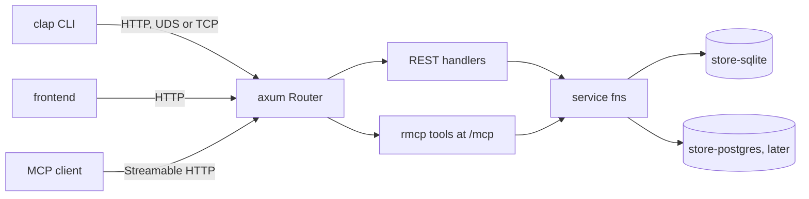

# sc-runtime Architecture

**ID Range:** ADR-RUN-0001 through ADR-RUN-0401  
**Status:** Draft  
**Created:** 2026-09-19  
**Last Updated:** 2026-09-19  
**Owner:** sc-runtime maintainers  

---

Repo-level architecture and ADRs for `sc-runtime`, extracted from
[`sc-runtime-design.md`](sc-runtime-design.md). Requirements are in
[`requirements.md`](requirements.md). Crate-level architecture and ADRs live in
`docs/<crate>/architecture.md`:
[sc-config](sc-config/architecture.md),
[sc-transport](sc-transport/architecture.md),
[sc-command](sc-command/architecture.md),
[sc-runtime](sc-runtime/architecture.md).

ADR entries follow the shared SC format in
the shared SC requirement and ADR templates.

## System shape

`sc-runtime` produces two kinds of thing: four library crates that are
published and versioned, and a template that is rendered once into a project
and then belongs to that project.

| Layer | What it holds | Owner | Lives in |
|---|---|---|---|
| Standalone crates | config loading; listener and client connector; response envelope | this repo, published | `crates/sc-config`, `crates/sc-transport`, `crates/sc-command` |
| Assembly crate | singleton lock, router merge, serve, graceful shutdown, test fixture | this repo, published | `crates/sc-runtime` |
| Application layer | operations, routes, MCP tools, CLI commands, stores, schemas | the generated project | rendered from `template/` |
| Generation tooling | options contract, fixtures, driver, wizard | this repo, not published | `wizard/`, `scripts/`, `tests/unit/` |

The dividing rule is upgradeability: generated code cannot be upgraded after
birth, a dependency can. So anything that should improve across all projects is
in a crate, and anything a project will want to edit is in the template.

## Runtime architecture

One daemon process owns the stores, and every client reaches it over HTTP
through one Axum router. REST handlers and MCP tools are both thin: each
deserialises into an `api-types` struct and calls the same async service
function, which is the only code path to SQL.



Request path for one operation: the CLI posts `CreateWidget` JSON to
`/ops/widget.create`; the handler calls `service::create_widget(stores,
input)`; the service function runs a checked sqlx query in the store crate; the
`Result<Widget, OpError>` becomes an envelope on the way out. An MCP
`tools/call` for `widget_create` joins the same path at the service function,
with the same `CreateWidget` struct as its input schema.

Daemon start-up, performed by `sc_runtime::Daemon::builder()` in a fixed order:
take the config the project already loaded; resolve the instance root and take
the `daemon.lock` singleton; call the project's stores closure; merge the
project's router with the OpenAPI document route, a health route and the MCP
service; bind the listener through `sc-transport` and serve until SIGINT or
SIGTERM. The project's `main.rs` loads config with `sc-config` and initialises
`sc-observability` itself before calling the builder.

## Crate graph

```text
sc-config      -> serde, serde_json
sc-transport   -> tokio, reqwest            (+ axum behind `server`)
sc-command     -> serde, sc-observability-types   (+ axum, rmcp behind `server`)
sc-runtime     -> sc-config, sc-transport[server], sc-command[server],
                  axum, tokio, fd-lock
```

There is no edge among `sc-config`, `sc-transport` and `sc-command`.
`sc-runtime` is the only crate that knows the others. In a generated project,
`daemon` depends on `sc-runtime` and `sc-config`; `cli` depends on
`sc-transport`, `sc-command`, `sc-config` and `api-types`, all without the
`server` feature. Each crate's edges are recorded in
`boundaries/<crate>/*.toml` and enforced by `sc-lint-boundary`.

## Generation architecture

One answers JSON file drives generation. It comes from the Wyvern wizard, from
a wizard prefilled by an agent, or directly from `--var-file`. The driver
validates it against `wizard/answers.schema.json`, writes a `[values]` TOML
file, runs `cargo generate` on `template/`, runs `sc-compose` on the two
agent-facing Jinja documents, then runs `just lint` and `just test` in the new
project. Template CI runs the same driver over every fixture in
`wizard/fixtures/`.

---

## ADR-RUN-0001: Framework instantiates, project wires; no command registry

**Status:** Active  
**Decision Date:** 2026-09-19  
**Source:** sc-runtime design, 2026-09-19: the principle was stated by the owner; replacing the command registry with shared service functions is a design recommendation accepted for sprint planning  

### Context

`sc-runtime` is a `cargo-generate` template plus four published library crates
(`sc-config`, `sc-transport`, `sc-command`, `sc-runtime`) that together give a
new project a working daemon: an Axum HTTP server, an MCP server (the `rmcp`
crate), a clap CLI and sqlx stores. Every operation of such a project must be
reachable from three surfaces: a REST route, an MCP tool and a CLI command.

An earlier plan for this scaffold used a typed command registry. A project
would register each command once, and the framework would generate the REST,
MCP and CLI adapters from the registry. That plan also called for a single
assembly point where the daemon is put together.

A registry puts the framework between the project and Axum, rmcp and clap.
That requires wrapper types around those libraries, a macro or code generator
that this repository must maintain, and a framework opinion about what a
command is. A project could then do only what the wrappers expose.

### Decision

1. An operation MUST be defined in project code as two request/response
   structs in the generated project's `api-types` crate plus one `async fn` in
   its `service` crate, of the form
   `pub async fn create_widget(s: &Stores, input: CreateWidget) -> Result<Widget, OpError>`.
2. The REST handler (`daemon/src/routes.rs`, `#[utoipa::path]` plus an axum
   handler), the MCP tool (`daemon/src/mcp.rs`, rmcp `#[tool]`) and the CLI
   command (`cli` crate, clap derive) MUST each be written with that library's
   own derive or macro. Each MUST only deserialise into the `api-types` struct
   and call the service function (the CLI reaches it over HTTP).
3. `sc_runtime::Daemon::builder()` in `crates/sc-runtime` is the single
   assembly point. It MUST do assembly only, in this order: take the config the
   project already loaded; resolve the instance root and take the
   `<instance-root>/daemon.lock` singleton; call the project's stores closure;
   merge the project's router, the OpenAPI document route, a health route and
   the MCP service if one was given; bind the listener through `sc-transport`
   and serve with graceful shutdown on SIGINT and SIGTERM.
4. The four library crates MUST NOT contain a command registry, a proc-macro,
   a code generator, or a public type that wraps or re-exports an Axum, rmcp or
   sqlx type.
5. The project MUST pass the builder an ordinary `utoipa_axum::OpenApiRouter`
   and, optionally, an ordinary rmcp service, each returned from a closure.
6. `Stores` is a plain struct defined by the project. `sc-runtime` MUST NOT
   inspect it; it MUST only hand the value returned by the stores closure to
   the project's routes closure and MCP closure.

The builder method names `stores`, `routes`, `mcp` and `run` are illustrative
and not yet pinned; the shape in points 3, 5 and 6 is what binds.

### Consequences

Which routes exist, which store a route uses and what data moves between
stores are project decisions in ordinary Rust. Anything Axum, rmcp or clap can
do, a project can do, using those libraries' own documentation.

The cost: nothing in these crates keeps the REST, MCP and CLI views of an
operation in step. Detecting drift between the three surfaces is left to the
sc-lint project and is not built in this repository
([ADR-RUN-0005](architecture.md)).

### Alternatives Considered

- A typed command registry with generated REST, MCP and CLI adapters.
  Rejected because it needs wrapper types and a generator maintained here, and
  limits projects to what the wrappers expose.
- A macro system that expands one annotated function into the three surfaces.
  Rejected for the same reason: it is a proc-macro crate this repository would
  own, where `#[utoipa::path]`, `#[tool]` and clap derive already exist.
- A portable abstraction (a trait) over the three surfaces. Rejected because
  it gives the framework an opinion about what an operation is and hides the
  libraries' real APIs from the project.

### Implementation

**Enforced by:** `arch-qa` review of each change against the six points above;
[NFR-RUN-0003](requirements.md) (the repository contains no command registry, macro system,
code generator, portable query layer or wrapper type); the `sc-runtime`
boundary manifest under `boundaries/sc-runtime/`, checked by
`sc-lint-boundary` through `just lint`, which MUST show no re-exported wrapper
types in the crate's public facade.

### Related Documents

- [NFR-RUN-0003](requirements.md): standard crates used the documented way; no registry,
  macro system, generator or wrapper type.
- [REQ-RUN-0201](requirements.md): one operation reaches SQL from REST, MCP and the CLI only
  through one service function.
- [REQ-RT-0001](sc-runtime/requirements.md): the builder and its fixed step order.
- [REQ-RT-0003](sc-runtime/requirements.md): `Stores` is an opaque generic parameter.

---

## ADR-RUN-0002: Thin template; crates published and named by version

**Status:** Active  
**Decision Date:** 2026-09-19  
**Source:** sc-runtime design, 2026-09-19: independent crates stated by the owner; one repository with crates.io versions is a design recommendation accepted for sprint planning. Replaces an earlier scaffold plan of path dependencies extracted later  

### Context

`sc-runtime` delivers reusable code to projects in two ways: as a
`cargo-generate` template rendered once into a new project, and as library
crates the project depends on. Code rendered from a template belongs to the
project from that moment and cannot be upgraded from here. A dependency can be
upgraded with `cargo update`.

An earlier plan for this scaffold started the reusable crates as path
dependencies whose source was copied into each generated project, to be
extracted into published crates in a later phase. Copied source has no upgrade
path: every fix would have to be re-applied by hand in every project.

### Decision

1. `sc-config`, `sc-transport`, `sc-command` and `sc-runtime` MUST be separate
   crates under `crates/` from the first commit, each a member of the root
   Cargo workspace of the repository `randlee/sc-runtime`.
2. Each crate MUST be published separately to crates.io with its own version,
   README and tests, and MUST be usable without the template.
3. `template/` MUST live in the same repository and MUST NOT be a workspace
   member, so that template CI tests the template against the crates at the
   same commit.
4. Every `Cargo.toml` rendered into a generated project MUST name these crates
   by crates.io version requirement and MUST NOT contain a `path =` dependency
   on any of them.
5. Before the first publish, and when testing unreleased changes, a
   `[patch.crates-io]` entry or a git tag MAY stand in for the published
   version.
6. Placement rule for new code: code that should improve across all projects
   MUST go in a crate; code a project will want to edit MUST go in the
   template.

### Consequences

Generated projects pick up fixes with `cargo update`. The template stays
small, which keeps the fixture matrix (one generated project per answers
fixture) cheap to run. Publishing becomes part of every release, and each
crate's public API is a semver contract from `v0.1.0`. Any crate can move to
its own repository later without an API change.

### Alternatives Considered

- Path dependencies copied into each generated project, extracted later.
  Rejected because copied code can never be upgraded.
- One monolithic `sc-runtime` crate. Rejected because config loading, the
  transport and the response envelope are useful to programs that are not
  sc-runtime daemons, and a CLI would have to link the daemon's dependencies.
- One repository per crate from day one. Rejected because template CI could no
  longer test the template against the crates at the same commit.

### Implementation

**Enforced by:** `req-qa` on [REQ-RUN-0003](requirements.md) (rendered `Cargo.toml` files
contain version requirements and no `path =` entry for these crates); the
fixture matrix ([REQ-RUN-0701](requirements.md)), which generates and tests a project per
fixture on every change.

### Related Documents

- [REQ-RUN-0001](requirements.md): one repository, one workspace, four crates, `template/`
  outside the workspace.
- [REQ-RUN-0002](requirements.md): each crate builds, tests and publishes on its own.
- [REQ-RUN-0003](requirements.md): generated projects name the crates by version, never by
  path.
- [REQ-RUN-0702](requirements.md): the `v0.1.0` release publishes the crates.

---

## ADR-RUN-0201: Daemon owns the database; all clients use HTTP

**Status:** Active  
**Decision Date:** 2026-09-19  
**Source:** sc-runtime design, 2026-09-19: stated by the owner and carried unchanged from the earlier SC scaffold decisions  

### Context

A generated project has a daemon process and a CLI. A CLI that opens the
database itself when no daemon is running is convenient, but it creates a
second writer to a SQLite file (SQLite allows one writer at a time), a second
code path to SQL, and behaviour that differs depending on whether a daemon
happens to be up.

### Decision

1. The daemon MUST be the only process that opens the local database.
2. The daemon MUST hold a hard singleton: an OS exclusive lock, taken with the
   `fd-lock` crate by `sc-runtime`, on the file `<instance-root>/daemon.lock`,
   held for the life of the process.
3. Every client (the project's own CLI, a frontend, an MCP client) MUST reach
   the daemon over HTTP. The listener is a Unix domain socket at
   `<instance-root>/daemon.sock` by default on macOS and Linux, and TCP on
   `127.0.0.1` by default on Windows.
4. The CLI MUST NOT have a direct-database mode and MUST NOT link sqlx.
5. When the daemon is unreachable, the CLI MUST report the typed error with
   code `DAEMON.NOT_RUNNING` and
   `suggested_action: "run <app> daemon start"`, and MUST exit non-zero.
6. The CLI MUST NOT start the daemon itself.

### Consequences

There is one code path to SQL and one writer of the local store. Every CLI
command needs a running daemon, so the error for its absence is typed and
carries a suggested action that a person or an agent can follow.

Whether a later version lets the CLI auto-start the daemon is undecided.
Report-only (points 5 and 6) is the binding behaviour until a later ADR
changes it, and nothing may assume auto-start.

The singleton governs the local store only. A shared Postgres store, when
`store-postgres` arrives after v0.1, may be written by daemons on several
hosts.

### Alternatives Considered

- A direct-database fallback in the CLI when no daemon is running. Rejected
  because it adds a second SQLite writer and a second code path to SQL.
- A PID file as the singleton mechanism. Rejected because it goes stale after
  a crash and races between two starting daemons.
- Probing the port or socket as the singleton mechanism. Rejected because it
  races: two daemons can both probe before either binds.

### Implementation

**Enforced by:** [NFR-RUN-0001](requirements.md) (`cargo tree` for the generated `cli` crate
shows no sqlx, so the CLI cannot open a database); the test in
[REQ-RUN-0202](requirements.md) that runs a CLI command with no daemon and asserts the code
`DAEMON.NOT_RUNNING`, the suggested action and a non-zero exit; the two-daemon
test in [REQ-RT-0002](sc-runtime/requirements.md).

### Related Documents

- [REQ-RUN-0202](requirements.md): the CLI has no fallback and returns `DAEMON.NOT_RUNNING`.
- [REQ-RT-0002](sc-runtime/requirements.md): the OS lock on `daemon.lock`; a second daemon fails
  before opening a store.
- [REQ-TRN-0006](sc-transport/requirements.md): `sc-transport` maps a connection failure to
  `TransportError::DaemonNotRunning`.

---

## ADR-RUN-0003: Crate dependency graph and the `server` cargo feature

**Status:** Active  
**Decision Date:** 2026-09-19  
**Source:** sc-runtime design, 2026-09-19: independent crates stated by the owner; the `server` feature is stated in the design's repository layout. That the feature is off by default is decided in this document  

### Context

Two properties pull against each other. Each of `sc-config`, `sc-transport`
and `sc-command` must be usable alone by programs that are not sc-runtime
daemons, and both the generated daemon and the generated CLI use
`sc-transport` and `sc-command`. Yet a CLI binary must not link Axum, rmcp or
sqlx, while the server-side halves of those two crates need Axum and rmcp.

### Decision

1. Allowed dependencies of each crate:

   | Crate | Always | Only with feature `server` |
   |---|---|---|
   | `sc-config` | serde, serde_json | none |
   | `sc-transport` | tokio, reqwest | axum |
   | `sc-command` | serde, `sc-observability-types` | axum, rmcp |
   | `sc-runtime` | `sc-config`, `sc-transport` with `server`, `sc-command` with `server`, axum, tokio, fd-lock | not applicable |

2. `sc-config`, `sc-transport` and `sc-command` MUST NOT depend on one
   another, because each must be usable without the others. `sc-runtime` MUST
   be the only crate that depends on the other three.
3. Server-side code MUST sit behind a cargo feature named `server`: in
   `sc-transport`, listener binding for `axum::serve` over UDS or TCP; in
   `sc-command`, the conversion of `Envelope<T>` into an axum response and
   into an rmcp `CallToolResult`.
4. The `server` feature MUST be off by default in both crates (decided in this
   document).
5. `sc-runtime` MUST enable `server` on both crates. In a generated project
   only the `daemon` crate may depend on `sc-runtime`; the `cli` crate MUST
   depend on `sc-transport`, `sc-command`, `sc-config` and `api-types` without
   the `server` feature.

### Consequences

A CLI depends on the default builds and links none of axum, rmcp or sqlx.

A shared concept cannot be shared by adding an edge between two standalone
crates. Example, decided in this document: `sc-transport` reports an
unreachable daemon as its own typed error `TransportError::DaemonNotRunning`
carrying the code and suggested action as plain strings, and the generated
project's CLI, which depends on both crates, maps it into an `OpError`
([ADR-TRN-0003](sc-transport/architecture.md)).

Feature-gated code MUST be tested both with and without `--features server`.

### Alternatives Considered

- Splitting each of the two crates into a `-client` and a `-server` crate.
  Rejected because it doubles the crates to publish and version for the same
  effect a feature gives.
- Letting `sc-command` depend on `sc-transport` so they can share the
  daemon-not-running error. Rejected because neither crate would then be
  usable alone.

### Implementation

**Enforced by:** the boundary manifests `boundaries/<crate>/*.toml` (allowed
dependencies and `forbidden_edges`), checked by `sc-lint-boundary` through
`just lint`; `cargo tree` output for the generated `cli` crate showing none of
axum, rmcp or sqlx, as evidence for [NFR-RUN-0001](requirements.md).

### Related Documents

- [NFR-RUN-0001](requirements.md): a CLI binary links none of axum, rmcp or sqlx.
- [REQ-RUN-0002](requirements.md): each crate is an independent deliverable.
- [REQ-RUN-0005](requirements.md): a boundary manifest per crate, enforced by
  `sc-lint-boundary`.
- [NFR-TRN-0001](sc-transport/requirements.md): `sc-transport` links axum only behind `server`.
- [NFR-CMD-0001](sc-command/requirements.md): `sc-command` links axum and rmcp only behind
  `server`.
- [NFR-RT-0003](sc-runtime/requirements.md): `sc-runtime` is the only assembler.

---

## ADR-RUN-0004: `sc-observability` is initialised by the project, not wrapped

**Status:** Active  
**Decision Date:** 2026-09-19  
**Source:** sc-runtime design, 2026-09-19: stated by the owner  

### Context

`sc-observability` 1.2.x is the SC logging standard and every generated
daemon uses it. The tempting design is to have `sc-config` or `sc-runtime`
initialise it. That would make those crates depend on the observability
stack, so `sc-config` could no longer be used by a program that does not use
`sc-observability`, and observability would in turn be tied to how config is
loaded.

### Decision

1. `sc-config`, `sc-transport`, `sc-command` and `sc-runtime` MUST NOT depend
   on `sc-observability` or on its OTel export crate.
2. Those four crates MUST NOT wrap `sc-observability`, re-export it, or define
   logging wrapper functions.
3. The only observability dependency allowed inside the four crates is
   `sc-observability-types` in `sc-command`, because the sc-ai-cli response
   envelope's error code and remediation types are defined in that crate.
4. The generated `daemon/src/main.rs` MUST, in this order: load config with
   `sc-config`; initialise `sc-observability` directly with plain values taken
   from that config; then call `sc_runtime::Daemon::builder()`.

### Consequences

`sc-config` has no observability dependency and can be used in any Rust
program. A project chooses its own log sinks and adds the OTel export crate
itself if it wants export.

How much daemon-internal logging the four crates emit in v0.1 depends on a
question that is undecided: whether a `tracing` bridge into
`sc-observability` is acceptable. Until it is decided, no code or plan may
assume such a bridge exists.

### Alternatives Considered

- `sc-runtime` (or `sc-config`) initialising `sc-observability` for the
  project. Rejected because it makes the library crates depend on the
  observability stack and removes the project's control over sinks.
- A logging facade defined inside these crates. Rejected because it is a
  wrapper this repository would maintain over a crate that is already the
  standard.

### Implementation

**Enforced by:** a `forbidden_edges` entry for `sc-observability` in each of
the four crates' boundary manifests under `boundaries/<crate>/`, checked by
`sc-lint-boundary` through `just lint`; `arch-qa` review of the generated
`daemon/src/main.rs` for the order in point 4.

### Related Documents

- [REQ-RUN-0309](requirements.md): the generated daemon initialises `sc-observability` 1.2.x
  directly in `main.rs`.
- [NFR-CFG-0002](sc-config/requirements.md): `sc-config` has minimal dependencies and none on
  observability.
- [NFR-CMD-0002](sc-command/requirements.md): `sc-command` takes only types from
  `sc-observability-types`.
- [NFR-RT-0002](sc-runtime/requirements.md): `sc-runtime` has no sqlx, observability or
  config-loading dependency.

---

## ADR-RUN-0202: One Axum router carries REST, OpenAPI and MCP

**Status:** Proposed  
**Decision Date:** 2026-09-19  
**Source:** sc-runtime design, 2026-09-19: MCP inside the daemon over HTTP stated by the owner; rmcp and stateless mode are design recommendations; two facts are marked by the design as unverified  
**Acceptance:** made Active, or amended, by sprint aa-1  

### Context

A REST API with an OpenAPI document and an MCP server are usually separate
processes or separate ports. In an sc-runtime daemon they must be one binary
on one listener, and both must take their schemas from the same structs in
the generated project's `api-types` crate. The libraries involved (`axum`,
`utoipa-axum`, `rmcp`) are developed independently, and rmcp shipped five
versions in the 30 days before 2026-09-15, so whether they fit on one router
has to be proven, not assumed.

### Decision

1. REST routes and the `openapi.json` document MUST come from a
   `utoipa_axum::OpenApiRouter` populated with the `routes!` macro, so one
   registration yields both the router and the spec.
2. MCP tools MUST be defined with rmcp `#[tool]` and `#[tool_router]`, taking
   input as `Parameters<T>` where `T` is the `api-types` struct.
3. The MCP tools MUST be served by rmcp's `StreamableHttpService` in stateless
   mode, mounted with `nest_service("/mcp", ...)` on the same Axum router and
   therefore the same listener and port as the REST routes.
4. Every manifest that names rmcp MUST pin it to a minor version.
5. Library versions: axum 0.8, utoipa-axum 0.2, rmcp 3.x.
6. `mcpkit-axum` and `aide` MUST NOT be used.

**OPEN:** the exact version pins for axum, utoipa, utoipa-axum and rmcp are
not known until sprint aa-1 records them.

**OPEN:** the URL path of the OpenAPI document route (the document is named
`openapi.json`) and the URL path of the health route are undecided.

### Consequences

Stateless mode means the template carries no MCP session store. MCP clients
that only speak stdio are out of scope for v0.1.

This ADR is Proposed because it rests on two facts that nobody has yet
verified. It is not binding, and no sprint other than aa-1 may depend on it,
until both are proven. Sprint aa-1 is the spike sprint: it builds the
throwaway binary `examples/spike` (axum, utoipa-axum, an rmcp stateless
service at `/mcp`, sqlx SQLite, a UDS listener, and a clap client using
reqwest `unix_socket`).

| # | Unverified fact | Evidence that proves it |
|---|---|---|
| 1 | rmcp 3.x, utoipa-axum 0.2 and axum 0.8 coexist on one router without version conflicts | `examples/spike` compiles with all three in one binary; `cargo tree -i axum` run on the spike package shows exactly one axum version; with the spike running, `curl --unix-socket`, the clap client and an MCP client each reach the same single service function through that one router |
| 2 | rmcp `Parameters<T>` accepts a struct that also derives `utoipa::ToSchema`, with no schema clash | the spike's request struct derives `Serialize`, `Deserialize`, `schemars::JsonSchema` and `utoipa::ToSchema`; it compiles as the `Parameters<T>` input of a `#[tool]`; MCP `tools/list` returns an input schema for that tool and `openapi.json` contains the same struct as a component schema |

When both rows are proven, sprint aa-1 MUST write the evidence and the exact
version pins for axum, utoipa, utoipa-axum and rmcp into this Consequences
section, remove the first `**OPEN:**` line, and set Status to Active. If
either fact is false, sprint aa-1 MUST amend the Decision to what the spike
found to work before setting Status to Active.

### Alternatives Considered

- `mcpkit-axum` as the MCP server library. Evaluated and rejected in favour of
  `rmcp`, the official Rust MCP SDK, which provides Streamable HTTP as a Tower
  service.
- `aide` for OpenAPI generation. Rejected in favour of `utoipa` with
  `utoipa-axum`; the choice is moot for schemas because one struct derives
  both `JsonSchema` and `ToSchema`.
- A separate MCP process or port. Rejected because MCP is required to be part
  of the daemon: same binary, same port, same service functions.

### Implementation

**Enforced by:** The spike `examples/spike` built in sprint aa-1, which
produces the evidence in the table above; after acceptance, the fixture
matrix ([REQ-RUN-0701](requirements.md)), which generates a project per answers fixture and
runs `just lint` and `just test` in it, so a breaking rmcp, utoipa-axum or
axum bump fails CI.

### Related Documents

- [REQ-RUN-0101](requirements.md): what `examples/spike` contains and which three clients
  must reach one service function.
- [REQ-RUN-0102](requirements.md): the spike records evidence and version pins and moves
  this ADR from Proposed to Active.
- [REQ-RUN-0205](requirements.md): project routes, `openapi.json`, a health route and `/mcp`
  on one listener.
- [REQ-RT-0004](sc-runtime/requirements.md): what `sc-runtime` mounts on the router.
- [NFR-RUN-0007](requirements.md): rmcp is pinned to a minor version in every manifest.

---

## ADR-RUN-0301: One store crate per database backend

**Status:** Active  
**Decision Date:** 2026-09-19  
**Source:** sc-runtime design, 2026-09-19: one code path to SQL and the SQLite-plus-Postgres pairing stated by the owner; one crate per backend is a design recommendation forced by sqlx 0.9  

### Context

SC projects commonly pair SQLite (fast local traffic) with Postgres (a shared
aggregate across hosts), with different schemas and roles. sqlx's `query!`
macros check each query at compile time against a live or cached schema for
one database, and sqlx 0.9 requires a separate crate per database to keep
checked queries. Its `sqlx.toml` lets each crate name its own database URL
variable, so two such crates can build in one workspace.

### Decision

1. A store MUST be one crate in the generated project bound to exactly one
   sqlx driver:

   | | `store-sqlite` | `store-postgres` |
   |---|---|---|
   | sqlx feature | `sqlite` | `postgres` |
   | URL variable in `sqlx.toml` | `SQLITE_DATABASE_URL` | `POSTGRES_DATABASE_URL` |
   | Migrations | `migrations/`, embedded with `sqlx::migrate!` | same |
   | Offline query data | `.sqlx/` checked in, produced by `just db-prepare` | same |
   | Default pool | read pool of N connections plus a one-connection write pool, WAL on | single pool |

2. Each store crate MUST expose `open(cfg) -> Result<Store>` and typed query
   functions.
3. Only the generated `service` crate may call store functions; no other
   generated crate may depend on sqlx.
4. A query MUST NOT be written to run on more than one backend, and there
   MUST NOT be a portable query layer.
5. Store crates are template code owned by the project. `sc-runtime` MUST only
   call the project's stores closure and MUST NOT inspect its result.
6. There MUST NOT be forwarding, replication, outbox or routing policy between
   stores in this repository.
7. v0.1 ships `store-sqlite` only. `store-postgres` and the `db = both` option
   follow, then `store-mysql` when a project needs it. SQL Server is out of
   scope because sqlx has no driver for it.

**OPEN:** the value of N for the SQLite read pool is undecided.

### Consequences

Both backends can build in one workspace. Each service function uses
whichever store it needs. The SQLite default (many readers, one write
connection) is correct under concurrency with no custom code. The batched
write actor from the atm-core project is the known upgrade when a project
measures write contention; it is not part of v0.1.

### Alternatives Considered

- A portable query layer that runs one query on several backends. Rejected
  because sqlx's checked queries are per database, and the two stores have
  different schemas and roles anyway.
- One store crate with a cargo feature per backend. Rejected because sqlx 0.9
  requires a separate crate per database for checked queries.
- The atm-core batched write actor as the SQLite default. Rejected for v0.1
  because it is custom code; the standard read-pool plus write-connection
  arrangement needs none.

### Implementation

**Enforced by:** the generated workspace's dependency edges, inspected with
`cargo metadata` per fixture ([REQ-RUN-0301](requirements.md)): only `store-*` crates depend
on sqlx and only `service` depends on `store-*`; `arch-qa` review for points
4 to 6.

### Related Documents

- [REQ-RUN-0308](requirements.md): the generated `store-sqlite` crate.
- [REQ-RUN-0201](requirements.md): all three surfaces reach SQL through one service
  function.
- [REQ-RT-0003](sc-runtime/requirements.md): `sc-runtime` never inspects `Stores`.

---

## ADR-RUN-0401: Generation pipeline and the `answers.schema.json` contract

**Status:** Proposed  
**Decision Date:** 2026-09-19  
**Source:** sc-runtime design, 2026-09-19: the Wyvern wizard and tool-per-job rule stated by the owner; schema contract, cargo-generate rendering, Python driver and fixture-matrix CI are design recommendations; `cargo-generate` behaviour is marked by the design as unverified  
**Acceptance:** made Active, or amended, by sprint aa-1  

### Context

A new project is generated from a set of options (project name, `db`, `mcp`).
The private repository `p3-nuget-template` already proved a pipeline for
this: a Wyvern wizard emits an answers JSON file, a JSON Schema validates it,
and a driver script renders the project. That repository uses a custom render
engine; for Rust, `cargo-generate` already exists. The agent-facing documents
`AGENTS.md` and `CLAUDE.md` must stay validated Jinja with frontmatter to
match the sc-ai-cli templates, and `cargo-generate`'s Liquid and Jinja both
use `{{ }}`, so one engine cannot render both kinds of file.

### Decision

1. `wizard/answers.schema.json` MUST be the single, versioned definition of
   every generation option: names, types, defaults, enums and conditional
   requirements.
2. The placeholder keys in `template/cargo-generate.toml` MUST equal the
   schema's keys. A unit test under `tests/unit/` MUST assert the two key sets
   are equal.
3. `cargo-generate` MUST render the Rust workspace. The driver writes the
   validated answers as a `[values]` TOML file and runs
   `cargo generate --path template --template-values-file values.toml --name <project>`.
4. Options MUST include or exclude whole files through conditional `ignore`
   lists in `cargo-generate.toml` (for example `crates/store-postgres`,
   `daemon/src/mcp.rs`).
5. `AGENTS.md.j2` and `CLAUDE.md.j2` MUST be listed under `exclude` in
   `cargo-generate.toml` so they are copied without Liquid rendering. The
   driver MUST then render them with `sc-compose` from the same answers and
   remove the `.j2` sources from the generated project.
6. The driver MUST be the Python script `scripts/new_project.py`, reusing
   `run_wizard.py` from `p3-nuget-template` as `scripts/run_wizard.py`, and
   exposed as `just new <dest>`. Its steps, in order: run the wizard unless
   `--var-file` is given; validate the answers against the schema; write
   `values.toml`; run `cargo generate`; run `sc-compose`; run `just lint` and
   `just test` in the generated project.
7. The driver MUST support three entry modes that all produce the same answers
   JSON: the interactive wizard; `--prefill <json>` (agent-written guesses
   merged into the wizard for human review); `--var-file <answers.json>`
   (no wizard, no prompts).
8. Template CI MUST run the driver with `--var-file` for each file in
   `wizard/fixtures/*.json`, then `just lint` and `just test` in the result.
   Wyvern MUST NOT be required in CI.
9. `wizard/` and `scripts/` MUST sit beside `template/` and MUST NOT be inside
   it, so nothing of them is copied into a generated project.

**OPEN:** the name and format of the version field in `answers.schema.json`
are undecided.

**OPEN:** the exact `cargo-generate` version pin is not known until sprint
aa-1 records it.

### Consequences

Each job uses an existing tool (`cargo-generate`, `sc-compose`, Wyvern) and
this repository writes no render engine. Plain `cargo generate` on `template/`
still works without Wyvern or the driver, using the placeholders' own prompts
and defaults. Python is a prerequisite for the driver; a Rust binary can
replace it later. The schema is also consumed by the sc-lint project, so it is
a published contract.

This ADR is Proposed because it rests on `cargo-generate` behaviour that
nobody has yet verified on the current release. It is not binding, and no
sprint other than aa-1 may depend on it, until every row below is proven.
Sprint aa-1 is the spike sprint; it proves these rows with a throwaway
template and values file.

| # | Unverified fact | Evidence that proves it |
|---|---|---|
| 1 | The current `cargo-generate` release accepts, in `cargo-generate.toml`, placeholder definitions of type `string`, `bool` and `array`, a conditional `ignore` list keyed on a placeholder value, and an `exclude` list; the exact syntax of each is known | a `cargo-generate.toml` using all three constructs, recorded in this section, that the current release parses without error |
| 2 | A conditional `ignore` list includes or excludes a whole file | two runs differing only in one `bool` value: the conditionally ignored file is present in one output and absent in the other |
| 3 | `cargo generate --path <template> --template-values-file <file> --name <n> --silent` runs fully non-interactively, including when a value is an `array` | the command run with stdin closed exits 0, prints no prompt, and the rendered output contains the `string`, `bool` and `array` values from the values file |
| 4 | A file listed under `exclude` is copied without rendering | a `.j2` file containing `{{ }}` expressions is byte-identical in the template and in the generated output |

When all four rows are proven, sprint aa-1 MUST write the evidence, the
working `cargo-generate.toml` syntax and the `cargo-generate` version pin into
this Consequences section, remove the second `**OPEN:**` line, and set Status
to Active. If any row is false, sprint aa-1 MUST amend the Decision to what
the spike found to work before setting Status to Active.

### Alternatives Considered

- A custom render engine, as `p3-nuget-template` has. Rejected because
  `cargo-generate` already does the job for Rust.
- A CI matrix built on `cargo-generate-action`. Rejected in favour of running
  the repository's own driver with `--var-file`, so CI exercises the same
  path people and agents use.
- Rendering the agent documents with Liquid. Rejected because they must stay
  validated Jinja matching the sc-ai-cli templates.
- A wizard-only flow with no `--var-file`. Rejected because CI and agents
  cannot answer prompts.

### Implementation

**Enforced by:** the `tests/unit/` tests (schema validity, key-set equality
between `answers.schema.json` and `cargo-generate.toml`, invalid fixtures
failing before `cargo generate` runs); the fixture matrix in
`.github/workflows/` described in point 8.

### Related Documents

- [REQ-RUN-0401](requirements.md) through [REQ-RUN-0403](requirements.md): the schema, the key-set test and the
  valid and invalid fixtures.
- [REQ-RUN-0501](requirements.md) through [REQ-RUN-0503](requirements.md): the driver pipeline, non-interactive
  mode and the green-with-no-edits gate.
- [REQ-RUN-0303](requirements.md) through [REQ-RUN-0306](requirements.md): v0.1 options, the limit on in-file
  Liquid, `sc-compose` rendering and plain `cargo generate`.
- [REQ-RUN-0601](requirements.md) through [REQ-RUN-0603](requirements.md): the Wyvern wizard and its three entry
  modes.
- [REQ-RUN-0701](requirements.md): fixture-matrix CI.
- [REQ-RUN-0102](requirements.md): the spike records the `cargo-generate` evidence and moves
  this ADR from Proposed to Active.

---

## ADR-RUN-0005: Lint and `just` infrastructure belong to sc-lint

**Status:** Active  
**Decision Date:** 2026-09-19  
**Source:** sc-runtime design, 2026-09-19: the shared `just` system and the inverted sc-lint hand-off stated by the owner; leaving drift checks to sc-lint and the placeholder `Justfile` are design recommendations accepted for sprint planning  

### Context

Every SC repository exposes the same base `just` commands, and Rust
repositories run a standard sc-lint setup behind them; the sc-lint repository
is the source of truth for both. An earlier scaffold plan also wanted
adapter-drift enforcement: tooling that keeps the REST, MCP and CLI views of
an operation in step. Building that tooling here, together with boundary
rules and `just` modules inside the template, would duplicate what sc-lint
owns and freeze a copy of it into every generated project, where it can never
be upgraded.

### Decision

1. `template/` MUST NOT contain lint configuration, crate-boundary rules,
   adapter-drift tooling or `just` modules.
2. This repository MUST NOT build surface-snapshot or adapter-drift tooling.
3. The template MUST ship a minimal placeholder `Justfile` that provides the
   standard base recipe names `just lint` and `just test` (and
   `just db-prepare` for the store crate's `.sqlx/` data), so generated
   projects and CI have stable gates.
4. When sc-lint ships its install command (of the form
   `sc-lint create --vars answers.json`; the exact command is sc-lint's to
   define), the driver `scripts/new_project.py` gains exactly one step that
   calls it with the answers JSON, and the placeholder `Justfile` is deleted
   from the template. The recipe names do not change.
5. The order of work is: the MVP generator produces a prototype set of
   generated repositories, one per meaningful option combination; the sc-lint
   team builds install packages from them; then the driver calls sc-lint.
6. This repository's own crates MUST be linted by the standard sc-lint setup,
   including `sc-lint-boundary`, through `just lint`.

### Consequences

When sc-lint's rules or the standard `just` system change, generated projects
pick that up from sc-lint and nothing in this repository changes. The only
interface between the two projects is the answers JSON and
`wizard/answers.schema.json`, which therefore must be versioned. What this
project hands to the sc-lint team is three things it already produces: the
schema, the answers fixtures in `wizard/fixtures/`, and the prototype
repositories generated from them.

### Alternatives Considered

- Snapshot files of `openapi.json`, MCP `tools/list` and the clap command
  model kept in this repository to detect drift. Rejected because it is custom
  tooling for a lint concern that sc-lint owns.
- Lint configuration and `just` modules rendered by the template. Rejected
  because a rendered copy cannot be upgraded when sc-lint's rules change.

### Implementation

**Enforced by:** [NFR-RUN-0006](requirements.md), checked by inspecting the contents of
`template/` for lint configuration, boundary rules and `just` modules;
`req-qa` on [REQ-RUN-0307](requirements.md) (the placeholder `Justfile`).

### Related Documents

- [REQ-RUN-0307](requirements.md): the placeholder `Justfile` and its recipe names.
- [NFR-RUN-0006](requirements.md): the template carries no lint knowledge.
- [REQ-RUN-0004](requirements.md): this repository's own `just lint`, `just test` and
  `just new <dest>`.
- [REQ-RUN-0005](requirements.md): boundary manifests for this repository's crates.
- [REQ-RUN-0401](requirements.md): `answers.schema.json` is the versioned contract sc-lint
  consumes.

---

## ADR-RUN-0302: One shared `api-types` struct; no generated Rust client

**Status:** Active  
**Decision Date:** 2026-09-19  
**Source:** sc-runtime design, 2026-09-19: design recommendations accepted for sprint planning; the allowance for differing edge shapes was stated by the owner  

### Context

An earlier proposal generated the CLI's HTTP client with `progenitor` from
the daemon's OpenAPI document. `progenitor` reads OpenAPI 3.0.x and `utoipa`
5 emits OpenAPI 3.1.0, so that chain does not connect. Separately, REST and
MCP could each define their own request structs for the same operation, which
invites the two to drift apart.

### Decision

1. The template's example operation MUST define each request and response
   struct once, in the generated `api-types` crate, deriving `Serialize`,
   `Deserialize`, `schemars::JsonSchema` and `utoipa::ToSchema`, for example
   `pub struct CreateWidget { pub name: String }`.
2. The REST handler, the MCP tool (as `Parameters<CreateWidget>`) and the CLI
   command MUST all use that one struct; the `daemon` and `cli` crates both
   depend on `api-types`.
3. The template MUST NOT define the same logical struct twice.
4. There MUST NOT be a generated Rust client; `progenitor` is not used.
5. A project MAY give MCP and REST different JSON shapes at the edge, provided
   both convert to the same service-function input before anything reaches
   SQL. Nothing in the four library crates enforces either choice.

### Consequences

Daemon and CLI compile against the same structs, which gives the type safety
a generated client would give, without a generator. One struct for every
surface satisfies the sc-ai-cli convention that a CLI's JSON is not reshaped
between surfaces, and makes the choice between `utoipa` and `aide` irrelevant
for schemas. Frontends still generate a TypeScript client from the daemon's
`openapi.json` with whichever generator they prefer.

### Alternatives Considered

- `progenitor` generating the CLI client from `openapi.json`. Rejected because
  it reads OpenAPI 3.0.x only and `utoipa` 5 emits 3.1.0.
- Separate request structs per surface in the template example. Rejected
  because the example is what projects copy, and duplicate structs drift.

### Implementation

**Enforced by:** `arch-qa` review of `template/` for points 1 to 4; the check
in the spike `examples/spike` that one struct deriving both `JsonSchema` and
`ToSchema` compiles as an rmcp `Parameters<T>` input with no schema clash.

### Related Documents

- [REQ-RUN-0201](requirements.md): an operation is one pair of `api-types` structs and one
  service function.
- [REQ-RUN-0301](requirements.md): the generated workspace layout, including `api-types`.
- [REQ-RUN-0302](requirements.md): the `widget.create` and `widget.get` example on all
  three surfaces.

---

## ADR-RUN-0006: Library errors are typed values; no public panics

**Status:** Active  
**Decision Date:** 2026-09-19  
**Source:** sc-runtime design, 2026-09-19: stated by the owner for `sc-config`; extended to all four crates in this document  

### Context

`sc-config` has a stated base requirement: every public method returns a
discriminated union (in Rust, `Result<T, ConfigError>` with a typed error
enum) and nothing panics. The same reasoning applies to all four crates: they
run inside long-lived daemons, where a panic is an outage, and inside CLIs
driven by agents, where a panic is a failure no caller can parse.

### Decision

1. Every fallible public function in `sc-config`, `sc-transport`, `sc-command`
   and `sc-runtime` MUST return `Result<T, E>` where `E` is that crate's one
   typed error enum (decided in this document): `ConfigError` in `sc-config`,
   `TransportError` in `sc-transport`, `RuntimeError` in `sc-runtime`.
2. No public function in those crates may panic on caller input or on
   environment state: no `unwrap`, `expect`, `panic!` or panicking index may
   be reachable from a public function.
3. Public APIs MUST NOT return opaque errors such as `anyhow::Error`.
4. An error that crosses a process boundary MUST be an `OpError` inside the
   response envelope `{version, ok, data, error}`. `OpError` has the fields
   `kind`, `code`, `message`, `details` and `suggested_action`; `code` is a
   stable string such as `DAEMON.NOT_RUNNING`.

**OPEN:** the name of `sc-command`'s error enum, and whether `sc-command` has
any fallible public function that needs one, is undecided.

### Consequences

Callers can branch on error variants. The generated `daemon/src/main.rs`
returns `ExitCode` and turns config and runtime errors into exit codes and
messages. Each crate carries a small error enum and a test per variant.

### Alternatives Considered

- `anyhow`-style opaque errors in public APIs. Rejected because callers and
  agents cannot branch on them.
- Constructors that panic on bad input. Rejected because config loads at the
  top of `main` before logging exists, where a panic is the least diagnosable
  failure.

### Implementation

**Enforced by:** the per-crate NFRs listed below; `rust-best-practices-agent`
review for panicking constructs reachable from public functions; `req-qa` on
[NFR-RUN-0009](requirements.md).

### Related Documents

- [NFR-RUN-0009](requirements.md): no public library function panics; errors are typed
  values.
- [NFR-CFG-0001](sc-config/requirements.md): every `sc-config` method returns
  `Result<T, ConfigError>`.
- [NFR-TRN-0004](sc-transport/requirements.md): `sc-transport` errors are values.
- [NFR-CMD-0003](sc-command/requirements.md): no public `sc-command` function panics.
- [NFR-RT-0004](sc-runtime/requirements.md): `sc-runtime` errors are values.
- [REQ-RUN-0203](requirements.md): every surface responds with the envelope
  `{version, ok, data, error}`.
