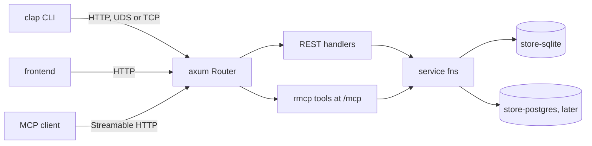

# sc-runtime Architecture

**ID Range:** ADR-RUN-0001 through ADR-RUN-0402  
**Status:** Draft  
**Created:** 2026-09-19  
**Last Updated:** 2026-09-19  
**Owner:** sc-runtime maintainers  

---

Repo-level architecture and ADRs for `sc-runtime`, extracted from
[`sc-runtime-design.md`](sc-runtime-design.md). Requirements are in
[`requirements.md`](requirements.md). Crate-level architecture and ADRs live in
`docs/<crate>/architecture.md`:
[sc-config](sc-config/architecture.md),
[sc-transport](sc-transport/architecture.md),
[sc-command](sc-command/architecture.md),
[sc-runtime](sc-runtime/architecture.md).

ADR entries follow the shared SC requirement and ADR templates.

Decided in this document: ADRs live in the architecture files; the design's
`docs/adr/` directory is not used; the design's gate "ADR amendments written
and accepted" is met by ADR-RUN-0001 and ADR-RUN-0201 being Active.

An ADR whose status field reads Active or Approved is binding on every plan,
change and fix. An ADR whose status field reads Proposed is not binding, and
no sprint may depend on it, until it is made Active. ADR ids have the form
`ADR-<DOMAIN>-nnnn`, where the domain is `RUN` (this file), `CFG`, `TRN`,
`CMD` or `RT` (the crate files).

## System shape

`sc-runtime` produces two kinds of thing: four library crates that are
published and versioned, and a template that is rendered once into a project
and then belongs to that project.

| Layer | What it holds | Owner | Lives in |
|---|---|---|---|
| Standalone crates | config loading; listener and client connector; response envelope | this repo, published | `crates/sc-config`, `crates/sc-transport`, `crates/sc-command` |
| Assembly crate | singleton lock, router merge, serve, graceful shutdown, test fixture | this repo, published | `crates/sc-runtime` |
| Application layer | operations, routes, MCP tools, CLI commands, stores, schemas | the generated project | rendered from `template/` |
| Generation tooling | options contract, fixtures, driver, wizard | this repo, not published | `wizard/`, `scripts/`, `tests/unit/` |

The dividing rule is upgradeability: generated code cannot be upgraded after
birth, a dependency can. So anything that should improve across all projects is
in a crate, and anything a project will want to edit is in the template.

## Runtime architecture

One daemon process owns the stores, and every client reaches it over HTTP
through one Axum router. REST handlers and MCP tools are both thin: each
deserialises into an `api-types` struct and calls the same async service
function, which is the only code path to SQL.

Request path for one operation: the CLI posts `CreateWidget` JSON to
`/ops/widget.create`; the handler calls `service::create_widget(stores,
input)`; the service function runs a checked sqlx query in the store crate; the
`Result<Widget, OpError>` becomes an envelope on the way out. An MCP
`tools/call` for `widget_create` joins the same path at the service function,
with the same `CreateWidget` struct as its input schema.

Daemon start-up, performed by `sc_runtime::Daemon::builder()` in a fixed order:
take the config the project already loaded; resolve the instance root and take
the `daemon.lock` singleton; call the project's stores closure; merge the
project's router with the OpenAPI document route, a health route and the MCP
service; bind the listener through `sc-transport` and serve until SIGINT or
SIGTERM. The project's `main.rs` loads config with `sc-config` and initialises
`sc-observability` itself before calling the builder.

`<instance-root>` is the per-application, per-user directory resolved by
sc-transport, or an explicitly supplied path; its default location is
undecided ([REQ-TRN-0002](sc-transport/requirements.md)). There is one
`axum::Router`, served unchanged on every listener `run()` binds; whether the
builder can bind a UDS and a TCP listener at once in v0.1 is undecided
([REQ-RT-0001](sc-runtime/requirements.md)).

## Crate graph

This section mirrors [REQ-RUN-0005](requirements.md), which owns the
workspace-internal edges and the forbidden edges of the four library crates.

| Crate | Workspace crates it depends on | Forbidden edges (`forbidden_edges`) |
|---|---|---|
| `sc-config` | none | `sc-transport`, `sc-command`, `sc-runtime`, `sc-observability`, `sc-observability-otlp`, `tokio` |
| `sc-transport` | none | `sc-config`, `sc-command`, `sc-runtime`, `sc-observability`, `sc-observability-otlp` |
| `sc-command` | none | `sc-config`, `sc-transport`, `sc-runtime`, `sc-observability`, `sc-observability-otlp` |
| `sc-runtime` | MUST: `sc-transport` with its `server` cargo feature, `sc-command` with its `server` cargo feature. MAY: `sc-config` (see the OPEN below) | `sqlx`, `sc-observability`, `sc-observability-otlp` |

**OPEN:** the sc-runtime design lists the edge `sc-runtime` -> `sc-config` but
names nothing that `sc-runtime` uses from `sc-config`, and `sc-runtime` MUST
NOT load configuration ([NFR-RT-0002](sc-runtime/requirements.md)). The edge is
therefore recorded as MAY. Whether it exists in v0.1, and for what, is
undecided.

The allowed third-party dependencies of each crate are owned by that crate's
NFR and are not restated here:
[NFR-CFG-0002](sc-config/requirements.md) for `sc-config`,
[NFR-TRN-0001](sc-transport/requirements.md) for `sc-transport`,
[NFR-CMD-0001](sc-command/requirements.md) for `sc-command`,
[NFR-RT-0003](sc-runtime/requirements.md) for `sc-runtime`.

There is no edge among `sc-config`, `sc-transport` and `sc-command`.
`sc-runtime` is the only crate that knows the others. The inter-crate edges
and each crate's public facade list are recorded in
`boundaries/<crate>/*.toml` and enforced by `sc-lint-boundary`.
Feature-conditional dependencies (`axum` and `rmcp` only behind `server`) are
enforced by `cargo tree` checks, because the manifest format has no
cargo-feature key ([ADR-RUN-0003](architecture.md)). The crate graph of a
generated project is [ADR-RUN-0303](architecture.md).

## Generation architecture

One answers JSON file drives generation. It comes from the Wyvern wizard, from
a wizard prefilled by an agent, or directly from `--var-file`. The driver
validates it against `wizard/answers.schema.json`, writes a `[values]` TOML
file, runs `cargo generate` on `template/`, runs `sc-compose` on the two
agent-facing Jinja documents, then runs `just lint` and `just test` in the new
project. Template CI runs the same driver over every fixture in
`wizard/fixtures/`.

## Index of ADRs

`Active` is binding. `Proposed` is not binding until sprint aa-1 (the spike
sprint) makes it `Active` or amends it.

| Id | Title | Status |
|---|---|---|
| ADR-RUN-0001 | Framework instantiates, project wires; no command registry | Active |
| ADR-RUN-0002 | Thin template; crates published and named by version | Active |
| ADR-RUN-0003 | Crate dependency graph and the `server` cargo feature | Active |
| ADR-RUN-0004 | `sc-observability` is initialised by the project, not wrapped | Active |
| ADR-RUN-0005 | Lint and `just` infrastructure belong to sc-lint | Active |
| ADR-RUN-0006 | Library errors are typed values; no public panics | Active |
| ADR-RUN-0007 | Async end to end on Tokio; `sc-config` is synchronous | Active |
| ADR-RUN-0008 | Requirements must mean less code; prefer standard designs | Active |
| ADR-RUN-0009 | Daemon-process tests run in a virtual machine; no test daemon | Active |
| ADR-RUN-0201 | Daemon owns the database; all clients use HTTP | Active |
| ADR-RUN-0202 | One Axum router carries REST, OpenAPI and MCP | Active |
| ADR-RUN-0203 | Library versions on one router; one struct for both schemas | Proposed |
| ADR-RUN-0204 | The CLI auto-starts the daemon, launched as launchd would | Active |
| ADR-RUN-0301 | One store crate per database backend | Active |
| ADR-RUN-0302 | One shared `api-types` struct; no generated Rust client | Active |
| ADR-RUN-0303 | Crate graph of the generated workspace | Active |
| ADR-RUN-0401 | Generation pipeline and the `answers.schema.json` contract | Active |
| ADR-RUN-0402 | `cargo-generate` mechanics used by the generation pipeline | Proposed |

---

## ADR-RUN-0001: Framework instantiates, project wires; no command registry

**Status:** Active  
**Decision Date:** 2026-09-19  
**Source:** sc-runtime design, 2026-09-19: the principle was stated by the owner; replacing the command registry with shared service functions is a design recommendation accepted for sprint planning  
**Amends:** SC scaffold ADR-013 (single assembly point / command registry)  

### Context

`sc-runtime` is a `cargo-generate` template plus four published library crates
(`sc-config`, `sc-transport`, `sc-command`, `sc-runtime`) that together give a
new project a working daemon: an Axum HTTP server, an MCP server (the `rmcp`
crate), a clap CLI and sqlx stores. Every operation of such a project must be
reachable from three surfaces: a REST route, an MCP tool and a CLI command.

An earlier plan for this scaffold used a typed command registry. A project
would register each command once, and the framework would generate the REST,
MCP and CLI adapters from the registry. That plan also called for a single
assembly point where the daemon is put together. That plan is the decision
this ADR amends: the single assembly point is kept, the command registry is
not.

A registry puts the framework between the project and Axum, rmcp and clap.
That requires wrapper types around those libraries, a macro or code generator
that this repository must maintain, and a framework opinion about what a
command is. A project could then do only what the wrappers expose.

### Decision

1. An operation MUST be defined in project code as two request/response
   structs in the generated project's `api-types` crate plus one `async fn` in
   its `service` crate, of the form
   `pub async fn create_widget(s: &Stores, input: CreateWidget) -> Result<Widget, OpError>`.
2. The REST handler (`daemon/src/routes.rs`, `#[utoipa::path]` plus an axum
   handler), the MCP tool (`daemon/src/mcp.rs`, rmcp `#[tool]`) and the CLI
   command (`cli` crate, clap derive) MUST each be written with that library's
   own derive or macro. Each MUST only deserialise into the `api-types` struct
   and call the service function (the CLI reaches it over HTTP).
3. `sc_runtime::Daemon::builder()` in `crates/sc-runtime` is the single
   assembly point. It MUST do assembly only, in this order: take the config the
   project already loaded; resolve the instance root and take the
   `<instance-root>/daemon.lock` singleton; call the project's stores closure;
   merge the project's router, the OpenAPI document route, a health route and
   the MCP service if one was given; bind the listener through `sc-transport`
   and serve with graceful shutdown on SIGINT and SIGTERM.
4. The four library crates MUST NOT contain a command registry, a proc-macro,
   a code generator, or a public type that wraps or re-exports an Axum, rmcp or
   sqlx type.
5. The project MUST pass the builder an ordinary `utoipa_axum::OpenApiRouter`
   and, optionally, an ordinary rmcp service, each returned from a closure.
6. `Stores` is a plain struct defined by the project. `sc-runtime` MUST NOT
   inspect it; it MUST only hand the value returned by the stores closure to
   the project's routes closure and MCP closure.

`<instance-root>` is the per-application, per-user directory resolved by
sc-transport, or an explicitly supplied path; its default location is
undecided ([REQ-TRN-0002](sc-transport/requirements.md)).

The builder method names `stores`, `routes`, `mcp` and `run` are illustrative
and not yet pinned; the shape in points 3, 5 and 6 is what binds.

**OPEN:** whether the builder can bind two listeners (a UDS and a TCP listener
at once) in v0.1 is undecided ([REQ-RT-0001](sc-runtime/requirements.md)). In
either case there is one `axum::Router`, served unchanged on every listener
`run()` binds.

### Consequences

Which routes exist, which store a route uses and what data moves between
stores are project decisions in ordinary Rust. Anything Axum, rmcp or clap can
do, a project can do, using those libraries' own documentation.

The cost: nothing in these crates keeps the REST, MCP and CLI views of an
operation in step. Detecting drift between the three surfaces is left to the
sc-lint project and is not built in this repository
([ADR-RUN-0005](architecture.md)).

### Alternatives Considered

- A typed command registry with generated REST, MCP and CLI adapters.
  Rejected because it needs wrapper types and a generator maintained here, and
  limits projects to what the wrappers expose.
- A macro system that expands one annotated function into the three surfaces.
  Rejected for the same reason: it is a proc-macro crate this repository would
  own, where `#[utoipa::path]`, `#[tool]` and clap derive already exist.
- A portable abstraction (a trait) over the three surfaces. Rejected because
  it gives the framework an opinion about what an operation is and hides the
  libraries' real APIs from the project.

### Implementation

**Enforced by:** `arch-qa` review of each change against the six points above.
That review is the mechanism for point 4's ban on public types that wrap or
re-export an Axum, rmcp or sqlx type, because `sc-lint-boundary` has no
wrapper-type analysis; [NFR-RUN-0003](requirements.md) (the repository contains no command
registry, macro system, code generator, portable query layer or wrapper type),
with its `proc-macro` and `macro_rules!` greps; the `[public] facade` list in
the `sc-runtime` boundary manifest under `boundaries/sc-runtime/`, checked by
`sc-lint-boundary` through `just lint`, which makes every addition to the
crate's exported items a visible manifest change for that review.
`sc-lint-boundary` checks inter-crate edges and the public facade list only.

### Related Documents

- [NFR-RUN-0003](requirements.md): standard crates used the documented way; no registry,
  macro system, generator or wrapper type.
- [REQ-RUN-0201](requirements.md): one operation reaches SQL from REST, MCP and the CLI only
  through one service function.
- [REQ-RT-0001](sc-runtime/requirements.md): the builder and its fixed step order.
- [REQ-RT-0003](sc-runtime/requirements.md): `Stores` is an opaque generic parameter.
- [REQ-TRN-0002](sc-transport/requirements.md): how `sc-transport` resolves the instance
  root.

---

## ADR-RUN-0002: Thin template; crates published and named by version

**Status:** Active  
**Decision Date:** 2026-09-19  
**Source:** sc-runtime design, 2026-09-19: independent crates stated by the owner; one repository with crates.io versions is a design recommendation accepted for sprint planning. Replaces an earlier scaffold plan of path dependencies extracted later. The review check in point 6 is decided in this document  

### Context

`sc-runtime` delivers reusable code to projects in two ways: as a
`cargo-generate` template rendered once into a new project, and as library
crates the project depends on. Code rendered from a template belongs to the
project from that moment and cannot be upgraded from here. A dependency can be
upgraded with `cargo update`.

An earlier plan for this scaffold started the reusable crates as path
dependencies whose source was copied into each generated project, to be
extracted into published crates in a later phase. Copied source has no upgrade
path: every fix would have to be re-applied by hand in every project.

### Decision

1. `sc-config`, `sc-transport`, `sc-command` and `sc-runtime` MUST be separate
   crates under `crates/` from the first commit, each a member of the root
   Cargo workspace of the repository `randlee/sc-runtime`.
2. Each crate MUST be published separately to crates.io with its own version,
   README and tests, and MUST be usable without the template.
3. `template/` MUST live in the same repository as the crates, so that
   template CI can test the template against the crates at the same commit.
   `template/` MUST NOT be a member of the root Cargo workspace, because its
   files are `cargo-generate` template sources that contain placeholders and
   are not a compilable package until rendered.
4. Every `Cargo.toml` rendered into a generated project MUST name these crates
   by crates.io version requirement and MUST NOT contain a `path =` dependency
   on any of them.
5. Before the first publish, and when testing unreleased changes, a
   `[patch.crates-io]` entry or a git tag MAY stand in for the published
   version.
6. Placement rule for new code: code that should improve across all projects
   MUST go in a crate; code a project will want to edit MUST go in the
   template. Check, decided in this document: a change that adds Rust code
   under `template/` other than the example operation, the wiring of routes,
   MCP tools, CLI commands and stores, or configuration MUST state in its
   sprint document why that code cannot live in a crate.

**OPEN:** point 3's same-commit testing needs a generated project to resolve
the four crates from the checked-out `crates/` directory and not from
crates.io. Who writes the `[patch.crates-io]` entry that does this (a template
option, the driver `scripts/new_project.py`, or the CI workflow) is undecided
([REQ-RUN-0003](requirements.md)). The release run of the fixture matrix
resolves the crates from crates.io ([REQ-RUN-0702](requirements.md)), so that
run tests the published versions and not the same commit.

### Consequences

Generated projects pick up fixes with `cargo update`. The template stays
small, which keeps the fixture matrix (one generated project per answers
fixture) cheap to run. Publishing becomes part of every release, and each
crate's public API is a semver contract from `v0.1.0`. Any crate can move to
its own repository later without an API change.

### Alternatives Considered

- Path dependencies copied into each generated project, extracted later.
  Rejected because copied code can never be upgraded.
- One monolithic `sc-runtime` crate. Rejected because config loading, the
  transport and the response envelope are useful to programs that are not
  sc-runtime daemons, and a CLI would have to link the daemon's dependencies.
- One repository per crate from day one. Rejected because a change that
  touches a crate and the template together could no longer be made and
  tested in one commit.

### Implementation

**Enforced by:** `req-qa` on [REQ-RUN-0001](requirements.md) (points 1 and 3: four crates
under `crates/` in one workspace, `template/` outside it); `req-qa` on
[REQ-RUN-0002](requirements.md) (point 2: each crate builds, tests and publishes on its
own); `req-qa` on [REQ-RUN-0003](requirements.md) (points 4 and 5: rendered `Cargo.toml`
files contain version requirements and no `path =` entry for these crates);
the fixture matrix ([REQ-RUN-0701](requirements.md)), which generates and tests a project
per fixture on every change; `arch-qa` review of the sprint document for
point 6.

### Related Documents

- [REQ-RUN-0001](requirements.md): one repository, one workspace, four crates, `template/`
  outside the workspace.
- [REQ-RUN-0002](requirements.md): each crate builds, tests and publishes on its own.
- [REQ-RUN-0003](requirements.md): generated projects name the crates by version, never by
  path.
- [REQ-RUN-0702](requirements.md): the `v0.1.0` release publishes the crates.

---

## ADR-RUN-0003: Crate dependency graph and the `server` cargo feature

**Status:** Active  
**Decision Date:** 2026-09-19  
**Source:** sc-runtime design, 2026-09-19: independent crates stated by the owner; the `server` feature is stated in the design's repository layout. That the feature is off by default, the forbidden-edge lists, the testing rule in point 7 and the build-selection scope in point 8 are decided in this document  

### Context

Two properties pull against each other. Each of `sc-config`, `sc-transport`
and `sc-command` must be usable alone by programs that are not sc-runtime
daemons, and both the generated daemon and the generated CLI use
`sc-transport` and `sc-command`. Yet a CLI binary must not link Axum, rmcp or
sqlx, while the server-side halves of those two crates need Axum and rmcp.

Cargo unifies features across every package selected in one build. A cargo
feature therefore separates client and server code only when the CLI is built
as its own selection.

### Decision

1. Workspace-internal edges and forbidden edges of the four library crates.
   This table mirrors [REQ-RUN-0005](requirements.md), which owns it:

   | Crate | Workspace crates it depends on | Forbidden edges (`forbidden_edges`) |
   |---|---|---|
   | `sc-config` | none | `sc-transport`, `sc-command`, `sc-runtime`, `sc-observability`, `sc-observability-otlp`, `tokio` |
   | `sc-transport` | none | `sc-config`, `sc-command`, `sc-runtime`, `sc-observability`, `sc-observability-otlp` |
   | `sc-command` | none | `sc-config`, `sc-transport`, `sc-runtime`, `sc-observability`, `sc-observability-otlp` |
   | `sc-runtime` | MUST: `sc-transport` with its `server` cargo feature, `sc-command` with its `server` cargo feature. MAY: `sc-config` (see the OPEN below) | `sqlx`, `sc-observability`, `sc-observability-otlp` |

2. `sc-config`, `sc-transport` and `sc-command` MUST NOT depend on one
   another, because each must be usable without the others. `sc-runtime` MUST
   be the only crate that depends on any of the other three.
3. The allowed third-party dependencies of each crate are owned by that
   crate's NFR and are not restated here:
   [NFR-CFG-0002](sc-config/requirements.md) for `sc-config`,
   [NFR-TRN-0001](sc-transport/requirements.md) for `sc-transport`,
   [NFR-CMD-0001](sc-command/requirements.md) for `sc-command`,
   [NFR-RT-0003](sc-runtime/requirements.md) for `sc-runtime`.
4. Server-side code MUST sit behind a cargo feature named `server`: in
   `sc-transport`, listener binding for `axum::serve` over UDS or TCP; in
   `sc-command`, the conversion of `Envelope<T>` into an axum response and
   into an rmcp `CallToolResult`. `axum` in `sc-transport`, and `axum` and
   `rmcp` in `sc-command`, MUST be optional dependencies enabled only by that
   feature.
5. The `server` feature MUST be off by default in both crates (decided in this
   document).
6. `sc-runtime` MUST enable `server` on both crates. A generated `cli` crate
   MUST NOT enable `server` on either crate and MUST NOT depend on
   `sc-runtime` as a normal (non-dev) dependency; the rule and its scope are
   owned by [NFR-RUN-0001](requirements.md). The full crate graph of a
   generated project is [ADR-RUN-0303](architecture.md).
7. Feature-gated code MUST be tested both with and without
   `--features server` (decided in this document). The `just test` recipe of
   [REQ-RUN-0004](requirements.md) runs `cargo test -p <crate>` with default features for
   each of the four crates, and `cargo test -p sc-transport --features server`
   and `cargo test -p sc-command --features server`.
8. The property "a CLI links none of axum, rmcp or sqlx" is defined for a CLI
   built as its own selection, `cargo build -p cli`
   ([NFR-RUN-0001](requirements.md), which owns the property and its criterion).

**OPEN:** the sc-runtime design lists the edge `sc-runtime` -> `sc-config` but
names nothing that `sc-runtime` uses from `sc-config`, and `sc-runtime` MUST
NOT load configuration ([NFR-RT-0002](sc-runtime/requirements.md)). The edge is
therefore recorded as MAY. Whether it exists in v0.1, and for what, is
undecided.

**OPEN:** under `cargo build --workspace` (and `cargo test --workspace`) in a
generated project, cargo unifies features, so `sc-transport` and `sc-command`
are compiled once with `server` enabled and the `cli` binary is built against
them. Whether workspace-wide builds are exempt from the property in point 8,
or the two crates must instead be split into client and server crates, is
undecided. Sprint aa-1 (the spike sprint) MUST measure what a `cli` binary
links under both build selections before this is decided.

### Consequences

A CLI built with `cargo build -p cli` depends on the default builds of
`sc-transport` and `sc-command` and links none of axum, rmcp or sqlx. The same
is not claimed for a workspace-wide build (second OPEN above).

A shared concept cannot be shared by adding an edge between two standalone
crates. Example, decided in this document: `sc-transport` reports an
unreachable daemon as its own typed error `TransportError::DaemonNotRunning`
carrying the code and suggested action as plain strings, and the generated
project's CLI, which depends on both crates, maps it into an `OpError`
([ADR-TRN-0003](sc-transport/architecture.md)).

`sc-lint-boundary` cannot express "axum only with `server`": its manifest
format has no cargo-feature key. Feature-conditional dependencies are checked
with `cargo tree`, and wrapper-type rules by `arch-qa` review.

### Alternatives Considered

- Splitting each of the two crates into a `-client` and a `-server` crate. Not
  adopted for v0.1 planning because it doubles the crates to publish and
  version. It is not equivalent to a feature: a crate split is not subject to
  cargo feature unification, and a feature is. The second OPEN above may
  reopen this alternative once the spike has measured the workspace-wide
  build.
- Letting `sc-command` depend on `sc-transport` so they can share the
  daemon-not-running error. Rejected because neither crate would then be
  usable alone.

### Implementation

**Enforced by:** the boundary manifests `boundaries/<crate>/*.toml`, checked
by `sc-lint-boundary` through `just lint`, for the inter-crate edges and
forbidden edges of point 1 and for each crate's public facade list, and for
nothing else. The manifest format, observed in the sc-lint repository, is
TOML with `boundary_id`, `owner_package`, `[public] facade`,
`[implementation]`, `[composition] roots`, `[dependencies]` holding
`allowed_dependents`, `allowed_dependencies` and
`forbidden_edges = ["a -> b"]`, and `[references]`; it has no cargo-feature
key. Feature-conditional dependencies (point 4) are enforced by `cargo tree`
checks of this form, owned by [NFR-TRN-0001](sc-transport/requirements.md) and
[NFR-CMD-0001](sc-command/requirements.md):
`cargo tree -p <crate> -e normal --prefix none` prints no line beginning with
`axum ` or `rmcp ` (the name followed by a space). For the generated `cli`
crate the check is owned by [NFR-RUN-0001](requirements.md): the same command with
`-p cli` prints no line beginning with `axum `, `rmcp ` or `sqlx `. Point 7 is
enforced by the `just test` recipe ([REQ-RUN-0004](requirements.md)).

### Related Documents

- [NFR-RUN-0001](requirements.md): a CLI binary built as its own selection links none of
  axum, rmcp or sqlx; records the same feature-unification OPEN.
- [REQ-RUN-0002](requirements.md): each crate is an independent deliverable.
- [REQ-RUN-0004](requirements.md): what `just test` runs, with and without `server`.
- [REQ-RUN-0005](requirements.md): owner of the workspace-internal and forbidden edges; a
  boundary manifest per crate, enforced by `sc-lint-boundary`.
- [NFR-CFG-0002](sc-config/requirements.md): allowed third-party dependencies of `sc-config`.
- [NFR-TRN-0001](sc-transport/requirements.md): allowed third-party dependencies of
  `sc-transport`; axum only behind `server`.
- [NFR-CMD-0001](sc-command/requirements.md): allowed third-party dependencies of
  `sc-command`; axum and rmcp only behind `server`.
- [NFR-RT-0003](sc-runtime/requirements.md): allowed dependencies of `sc-runtime`, the only
  assembler.
- [ADR-CFG-0003](sc-config/architecture.md): rejects a cargo feature in `sc-config` because
  of feature unification, the same effect the second OPEN records here.
- [ADR-RUN-0303](architecture.md): the crate graph of a generated project.

---

## ADR-RUN-0004: `sc-observability` is initialised by the project, not wrapped

**Status:** Active  
**Decision Date:** 2026-09-19  
**Source:** sc-runtime design, 2026-09-19: stated by the owner  

### Context

`sc-observability` 1.2.x is the SC logging standard and every generated
daemon uses it. The tempting design is to have `sc-config` or `sc-runtime`
initialise it. That would make those crates depend on the observability
stack, so `sc-config` could no longer be used by a program that does not use
`sc-observability`, and observability would in turn be tied to how config is
loaded.

### Decision

1. `sc-config`, `sc-transport`, `sc-command` and `sc-runtime` MUST NOT depend
   on `sc-observability` or on its OTel export crate `sc-observability-otlp`.
2. Those four crates MUST NOT wrap `sc-observability`, re-export it, or define
   logging wrapper functions.
3. The only observability dependency allowed inside the four crates is
   `sc-observability-types` in `sc-command`, because the sc-ai-cli response
   envelope's error code and remediation types are defined in that crate.
4. The generated `daemon/src/main.rs` MUST, in this order: load config with
   `sc-config`; initialise `sc-observability` directly with plain values taken
   from that config; then call `sc_runtime::Daemon::builder()`.

### Consequences

`sc-config` has no observability dependency and can be used in any Rust
program. A project chooses its own log sinks and adds the OTel export crate
itself if it wants export.

How much daemon-internal logging the four crates emit in v0.1 depends on a
question that is undecided: whether a `tracing` bridge into
`sc-observability` is acceptable. Until it is decided, no code or plan may
assume such a bridge exists.

### Alternatives Considered

- `sc-runtime` (or `sc-config`) initialising `sc-observability` for the
  project. Rejected because it makes the library crates depend on the
  observability stack and removes the project's control over sinks.
- A logging facade defined inside these crates. Rejected because it is a
  wrapper this repository would maintain over a crate that is already the
  standard.

### Implementation

**Enforced by:** `forbidden_edges` entries for `sc-observability` and
`sc-observability-otlp` in each of the four crates' boundary manifests under
`boundaries/<crate>/` (the forbidden-edge table is owned by
[REQ-RUN-0005](requirements.md)), checked by `sc-lint-boundary` through `just lint`;
`arch-qa` review of points 2 and 3 and of the generated `daemon/src/main.rs`
for the order in point 4.

### Related Documents

- [REQ-RUN-0005](requirements.md): owner of the forbidden-edge table; `sc-observability`
  and `sc-observability-otlp` are forbidden for all four crates.
- [REQ-RUN-0309](requirements.md): the generated daemon initialises `sc-observability` 1.2.x
  directly in `main.rs`.
- [NFR-CFG-0002](sc-config/requirements.md): `sc-config` has minimal dependencies and none on
  observability.
- [NFR-CMD-0002](sc-command/requirements.md): `sc-command` takes only types from
  `sc-observability-types`.
- [NFR-RT-0002](sc-runtime/requirements.md): `sc-runtime` has no sqlx or observability
  dependency and does not load configuration.

---

## ADR-RUN-0005: Lint and `just` infrastructure belong to sc-lint

**Status:** Active  
**Decision Date:** 2026-09-19  
**Source:** sc-runtime design, 2026-09-19: the shared `just` system and the inverted sc-lint hand-off stated by the owner; leaving drift checks to sc-lint and the placeholder `Justfile` are design recommendations accepted for sprint planning. Point 6 (boundary manifests and `sc-lint-boundary` for this repository's own crates) is decided in this document  

### Context

Every SC repository exposes the same base `just` commands, and Rust
repositories run a standard sc-lint setup behind them; the sc-lint repository
is the source of truth for both. An earlier scaffold plan also wanted
adapter-drift enforcement: tooling that keeps the REST, MCP and CLI views of
an operation in step. Building that tooling here, together with boundary
rules and `just` modules inside the template, would duplicate what sc-lint
owns and freeze a copy of it into every generated project, where it can never
be upgraded.

### Decision

1. `template/` MUST NOT contain lint configuration, crate-boundary rules,
   adapter-drift tooling or `just` modules.
2. This repository MUST NOT build surface-snapshot or adapter-drift tooling.
3. The template MUST ship a minimal placeholder `Justfile` that provides the
   standard base recipe names `just lint` and `just test` (and
   `just db-prepare` for the store crate's `.sqlx/` data), so generated
   projects and CI have stable gates.
4. When sc-lint ships its install command (of the form
   `sc-lint create --vars answers.json`; the exact command is sc-lint's to
   define), the driver `scripts/new_project.py` gains exactly one step that
   calls it with the answers JSON, and the placeholder `Justfile` is deleted
   from the template. The recipe names do not change.
5. The order of work is: the MVP generator produces a prototype set of
   generated repositories, one per meaningful option combination; the sc-lint
   team builds install packages from them; then the driver calls sc-lint.
6. Decided in this document; the sc-runtime design does not state it: this
   repository's own crates MUST be linted by the standard sc-lint setup,
   including `sc-lint-boundary`, through `just lint`. `sc-lint-boundary`
   enforces inter-crate edges and each crate's public facade list only
   ([REQ-RUN-0005](requirements.md)).

### Consequences

When sc-lint's rules or the standard `just` system change, generated projects
pick that up from sc-lint and nothing in this repository changes. The only
interface between the two projects is the answers JSON and
`wizard/answers.schema.json`, which therefore must be versioned. What this
project hands to the sc-lint team is three things it already produces: the
schema, the answers fixtures in `wizard/fixtures/`, and the prototype
repositories generated from them.

### Alternatives Considered

- Snapshot files of `openapi.json`, MCP `tools/list` and the clap command
  model kept in this repository to detect drift. Rejected because it is custom
  tooling for a lint concern that sc-lint owns.
- Lint configuration and `just` modules rendered by the template. Rejected
  because a rendered copy cannot be upgraded when sc-lint's rules change.

### Implementation

**Enforced by:** [NFR-RUN-0006](requirements.md), checked by inspecting the contents of
`template/` for lint configuration, boundary rules and `just` modules;
`req-qa` on [REQ-RUN-0307](requirements.md) (the placeholder `Justfile`); `req-qa` on
[REQ-RUN-0005](requirements.md) for point 6.

### Related Documents

- [REQ-RUN-0307](requirements.md): the placeholder `Justfile` and its recipe names.
- [NFR-RUN-0006](requirements.md): the template carries no lint knowledge.
- [REQ-RUN-0004](requirements.md): this repository's own `just lint`, `just test` and
  `just new <dest>`.
- [REQ-RUN-0005](requirements.md): boundary manifests for this repository's crates.
- [REQ-RUN-0401](requirements.md): `answers.schema.json` is the versioned contract sc-lint
  consumes.
- [ADR-RUN-0401](architecture.md): the driver `scripts/new_project.py` that gains the one
  sc-lint step.

---

## ADR-RUN-0006: Library errors are typed values; no public panics

**Status:** Active  
**Decision Date:** 2026-09-19  
**Source:** sc-runtime design, 2026-09-19: stated by the owner for `sc-config` only. Extending the rule to `sc-transport`, `sc-command` and `sc-runtime`, the one-enum-per-crate rule and the banned-construct list are decided in this document  

### Context

`sc-config` has a stated base requirement: every public method returns a
discriminated union (in Rust, `Result<T, ConfigError>` with a typed error
enum) and nothing panics. The same reasoning applies to all four crates: they
run inside long-lived daemons, where a panic is an outage, and inside CLIs
driven by agents, where a panic is a failure no caller can parse.

Two public signatures in `sc-command` are dictated by third-party libraries
and cannot name an sc-runtime error enum: an rmcp `#[tool]` function must
return `Result<CallToolResult, McpError>`, and axum's `IntoResponse`
conversion cannot fail.

### Decision

The owner of the error rule and of the panic rule is
[NFR-RUN-0009](requirements.md); this ADR records the decision behind it.

1. Every fallible public function in `sc-config`, `sc-transport`, `sc-command`
   and `sc-runtime` MUST return `Result<T, E>` for the errors the crate itself
   originates, where `E` is that crate's one typed error enum: `ConfigError`
   in `sc-config`, `TransportError` in `sc-transport`, `RuntimeError` in
   `sc-runtime`. The design states this for `sc-config`; for the other crates
   it is decided in this document.
2. Recorded exception: `sc_command::IntoMcp::into_mcp` returns
   `Result<CallToolResult, McpError>`, where `McpError` is rmcp's error type,
   and the `sc-command` conversion of `Envelope<T>` into an axum response
   (`IntoResponse`) is infallible. Those signatures are dictated by rmcp and
   axum. Point 1 does not apply to them.
3. No public function in those crates may panic on caller input or on
   environment state. None of `unwrap`, `expect`, `panic!`, `unreachable!`,
   `todo!`, `unimplemented!`, panicking `[]` indexing may be reachable from a
   public function. There is no allowance for an exception justified by a
   code comment.
4. Public APIs MUST NOT return opaque errors such as `anyhow::Error` or
   `Box<dyn Error>`.
5. An error returned by a service function that crosses a process boundary
   MUST be an `OpError` inside the response envelope
   `{version, ok, data, error}`. `OpError` has the fields `kind`, `code`,
   `message`, `details` and `suggested_action`; `code` is a stable string such
   as `DAEMON.NOT_RUNNING`. The exact JSON keys, and whether an empty
   `details` or `suggested_action` is written as `null` or omitted, are
   defined by [REQ-CMD-0002](sc-command/requirements.md).

**OPEN:** whether `sc-command` needs an error enum of its own, and its name if
so, is undecided. Its only fallible public function known today is
`into_mcp`, which is covered by point 2.

**OPEN:** whether a response the framework produces before or outside a
service function is an envelope is undecided: an axum response for an unknown
route, an axum rejection of a request body, an rmcp protocol error. The owner
of this question is [REQ-RUN-0203](requirements.md). Point 5 makes no claim about those
responses.

### Consequences

Callers can branch on error variants. The generated `daemon/src/main.rs`
returns `ExitCode` and turns config and runtime errors into exit codes and
messages. `sc-config`, `sc-transport` and `sc-runtime` each carry a small
error enum and a test per variant.

### Alternatives Considered

- `anyhow`-style opaque errors in public APIs. Rejected because callers and
  agents cannot branch on them.
- Constructors that panic on bad input. Rejected because config loads at the
  top of `main` before logging exists, where a panic is the least diagnosable
  failure.
- Wrapping rmcp's `McpError` in an `sc-command` enum returned by `into_mcp`.
  Rejected because an rmcp `#[tool]` function must itself return
  `Result<CallToolResult, McpError>`, so every tool would have to convert
  back.

### Implementation

**Enforced by:** `req-qa` on [NFR-RUN-0009](requirements.md), which owns the rule and its
criteria; the per-crate NFRs listed below, which reference it and add only
crate-specific strictness; `rust-best-practices-agent` review for the banned
constructs of point 3 reachable from public functions.

### Related Documents

- [NFR-RUN-0009](requirements.md): owner of the error rule and the panic rule, including the
  `into_mcp` exception.
- [NFR-CFG-0001](sc-config/requirements.md): every fallible `sc-config` function returns
  `Result<T, ConfigError>`.
- [NFR-TRN-0004](sc-transport/requirements.md): `sc-transport` errors are `TransportError`
  values.
- [NFR-CMD-0003](sc-command/requirements.md): no public `sc-command` function panics; the
  `into_mcp` signature.
- [NFR-RT-0004](sc-runtime/requirements.md): `sc-runtime` errors are `RuntimeError` values.
- [REQ-CMD-0002](sc-command/requirements.md): the `OpError` type and its JSON keys.
- [REQ-RUN-0203](requirements.md): every surface responds with the envelope
  `{version, ok, data, error}`; owns the framework-generated-response
  question.

---

## ADR-RUN-0007: Async end to end on Tokio; `sc-config` is synchronous

**Status:** Active  
**Decision Date:** 2026-09-19  
**Source:** sc-runtime design, 2026-09-19: "everything is async end to end: handler, service function, sqlx pool" stated by the owner and carried unchanged from the earlier SC scaffold decisions; the synchronous `sc-config` follows from the design's dependency list for that crate. Point 4 (library crates, and what is outside the request path) is decided in this document; not stated by the sc-runtime design  

### Context

A daemon built with these crates serves REST requests and MCP tool calls on
one Tokio runtime, and reaches SQL through an `sqlx::Pool`, which is an async
API. A Tokio worker thread serves many requests, so one blocking call in a
handler or a service function stalls every other request scheduled on that
worker. `sc-config`, in contrast, is called once at the top of `main`, before
any request exists, and must stay usable by programs that have no async
runtime.

### Decision

1. The generated daemon MUST run on the Tokio runtime
   (`#[tokio::main] async fn main`).
2. Every step on the path of a request MUST be an `async fn`: the REST
   handler (`crates/daemon/src/routes.rs`), the MCP tool
   (`crates/daemon/src/mcp.rs`), the service function (`crates/service`), and
   the store query function, which awaits an `sqlx::Pool`.
3. Code on a request path MUST NOT block a Tokio runtime thread. The list of
   banned calls is owned by [NFR-RUN-0002](requirements.md).
4. Decided in this document; not stated by the sc-runtime design: points 2
   and 3 also apply to the server-side code of `sc-runtime` and
   `sc-transport` (serving requests, graceful shutdown) and to
   `sc_transport::Client`, whose request methods MUST be `async fn`.
   Bind-time and shutdown-time file operations in those crates (taking the
   `daemon.lock` lock, replacing a stale socket file when binding, removing
   the socket file on shutdown) are outside the request path and are not
   covered by point 3.
5. `sc-config` is the deliberate exception. Its public API MUST be
   synchronous, and it MUST NOT depend on `tokio`. Its `load` is called once
   at start-up and is not on a request path.

### Consequences

Latency under load is not hostage to one slow blocking call. Every service
function can be called from a REST handler and an MCP tool alike without a
bridge. A CLI that only needs configuration does not link an async runtime
for it. Reload, change notification and async interop for configuration, if
built later, go into a separate crate that depends on `sc-config`.

### Alternatives Considered

- Synchronous service functions run through `tokio::task::spawn_blocking`.
  Rejected because `sqlx::Pool` is already async, so this would add a bridge
  at every call for no gain.
- An async `sc-config` for uniformity. Rejected because it would bring
  `tokio` into every program that reads configuration once at start-up,
  including small CLIs.

### Implementation

**Enforced by:** the inspection and grep criteria of
[NFR-RUN-0002](requirements.md) over `crates/*/src` and `template`, including its
criterion for the request paths of `crates/sc-transport` and
`crates/sc-runtime`; the `tokio` entry in the forbidden edges of the
`sc-config` boundary manifest ([REQ-RUN-0005](requirements.md)), checked by
`sc-lint-boundary` through `just lint`; the `async fn` and `.await` grep of
[NFR-CFG-0003](sc-config/requirements.md).

### Related Documents

- [NFR-RUN-0002](requirements.md): owner of the async rule, the banned blocking calls and
  their criteria.
- [ADR-CFG-0003](sc-config/architecture.md): `sc-config` is synchronous and has two
  dependencies.
- [NFR-CFG-0003](sc-config/requirements.md): `sc-config` has a synchronous API in v0.1.
- [REQ-TRN-0004](sc-transport/requirements.md): socket-file operations at bind time, which
  are outside the request path.
- [REQ-RT-0005](sc-runtime/requirements.md): graceful shutdown, whose file operations are
  outside the request path.

---

## ADR-RUN-0008: Requirements must mean less code; prefer standard designs

**Status:** Active  
**Decision Date:** 2026-09-19  
**Source:** sc-runtime design, 2026-09-19: stated by the owner as the design's third principle ("standardise below the application layer, with general code, not extra requirements") and as "prefer standard designs over hand-rolled pieces"  

### Context

The purpose of `sc-runtime` is to stop projects hand-assembling the same
stack (Tokio, Axum, an MCP server, a clap CLI, sqlx stores) differently each
time. A framework that grows its own requirements, adapters and tooling moves
that work into the framework and makes every project learn it. Build, test,
reporting and runtime are the same in every project; projects legitimately
differ only at the application layer. This ADR governs what may enter the
requirements files, the architecture files and the sprint plans.

### Decision

1. A requirement or a crate boundary MUST be admitted only if it results in
   less code to write across the projects that use `sc-runtime`.
2. A requirement that can only be met by custom code or an adapter, where a
   standard tool or crate already does the job, MUST be rejected or rewritten
   to use that tool.
3. `sc-runtime` standardises build, test, reporting and runtime. It MUST NOT
   add requirements at the application layer.
4. Every building block of the four library crates and of the template MUST
   be a standard, widely used crate, used the way its own documentation
   shows. The list of chosen crates and the list of prohibited constructs
   (registry, macro system, code generator, portable query layer, wrapper
   type) are owned by [NFR-RUN-0003](requirements.md).
5. Points 1 to 3 apply to these documents themselves: every new or changed
   requirement, ADR and sprint deliverable is tested against them.

### Consequences

Several things a framework might be expected to have are deliberately absent:
a command registry, surface-snapshot tooling, a render engine, a SQLite write
actor, a logging facade. Each would add code here, so each waits until a
project asks for it. A reviewer may reject an addition solely because it
fails point 1.

### Alternatives Considered

- A framework with its own abstractions over Axum, rmcp and sqlx. Rejected
  because every abstraction is code this repository maintains and every
  project must learn, where the libraries are already documented.
- Adopting an existing scaffold (loco-rs, rust-web-app,
  axum-postgres-template). Rejected because none has the split between a
  daemon and a thin HTTP client; they remain pattern references.

### Implementation

**Enforced by:** [NFR-RUN-0004](requirements.md), by review of each sprint plan and of each
new or changed requirement (the reviewer states what code the requirement
saves a project from writing); [NFR-RUN-0003](requirements.md), by its `proc-macro` and
`macro_rules!` greps and by `arch-qa` review of each crate's public API.

### Related Documents

- [NFR-RUN-0004](requirements.md): requirements must mean less code; the review criteria.
- [NFR-RUN-0003](requirements.md): standard crates used the documented way; the prohibited
  constructs.
- [ADR-RUN-0001](architecture.md): no command registry, macro system or wrapper type.
- [ADR-RUN-0005](architecture.md): lint and `just` infrastructure are left to sc-lint.

---

## ADR-RUN-0009: Daemon-process tests run in a virtual machine; no test daemon

**Status:** Active  
**Decision Date:** 2026-09-20  
**Source:** decided by the owner on 2026-09-20, from experience in another SC project; not stated in the sc-runtime design  

### Context

Integration tests want to run the daemon. A developer's machine usually has
the application's real daemon running, so a test that starts a daemon there
either collides with it or must be made different from it. In another SC
project this produced thousands of daemons left running by tests, and the
daemon's singleton requirements and gates had to be strengthened to stop
them. The obvious way out is a test daemon: a crate or executable that is
mostly the daemon but safe to start in tests. It drifts from the production
daemon and increases the code to maintain, and tests against it stop proving
anything about the code that ships.

### Decision

The instance root is the per-application, per-user directory resolved by
sc-transport, or an explicitly supplied path; its default location is
undecided ([REQ-TRN-0002](sc-transport/requirements.md)). colima is a Linux
virtual-machine runtime for macOS.

1. The escape path for a test that is not safe on a developer's host is a
   virtual machine (colima is the named example) or an ephemeral CI runner.
   It is never a test variant of the daemon.
2. There MUST NOT be a test daemon: no crate, binary, cargo feature or build
   configuration that reproduces the daemon for tests, and no test-only
   switch in production daemon code. `sc_runtime::testing::DaemonFixture`,
   its crate-private shutdown trigger (which starts the same shutdown
   sequence a signal starts, [ADR-RT-0004](sc-runtime/architecture.md)) and a
   cargo feature that only gates the `testing` module are not a test daemon
   and not a test-only switch: they change no behaviour of `run()` and select
   no alternative code path. What is forbidden is code that makes the daemon
   behave differently under test.
3. A test that starts a daemon as a separate process, uses the default
   instance root, or involves the service manager or CLI auto-start MUST run
   only on an isolated machine and MUST NOT run on a developer's host.
4. A test that runs the daemon in-process through
   `sc_runtime::testing::DaemonFixture` on a temporary instance root MAY run
   on a developer's host, provided every resource the fixture daemon opens
   (lock, endpoint, database files) is under that temporary instance root.
   This is decided in this document as an interpretation of the owner's
   decision, which the owner has not yet confirmed;
   [ADR-RT-0004](sc-runtime/architecture.md) makes that fixture the real
   builder path, not a separate implementation. Where the endpoint does not
   derive from the instance root (the Windows TCP default, OPEN in
   [ADR-RT-0004](sc-runtime/architecture.md)), fixture tests are
   daemon-process tests under point 3 until that is decided.
   A host-run test that executes the CLI binary MUST run it with auto-start
   disabled; a CLI invocation with auto-start enabled is a daemon-process
   test under point 3, because the CLI starts a real, detached daemon when it
   cannot reach one ([ADR-RUN-0204](architecture.md)).
5. The `daemon.lock` singleton MUST NOT be weakened for tests.
6. Building or provisioning a virtual machine is not part of v0.1. The rule
   MUST reach generated projects as written guidance in their `AGENTS.md` and
   `CLAUDE.md`.

**OPEN:** how daemon-process tests are selected and how they detect an
isolated machine, and where the macOS-only launchd comparison runs, are
undecided; [NFR-RUN-0010](requirements.md) owns both questions.

### Consequences

Production daemon code has one shape, and tests exercise it. A developer's
`just test` stays safe and fast, because it runs only in-process fixture
tests. The tests that need a real daemon process, the real singleton and the
real service manager run where a leaked or colliding daemon costs nothing.
Until a virtual machine is set up for a project, those tests run only in CI.
The launchd comparison needs macOS, which a Linux virtual machine cannot
give.

### Alternatives Considered

- A test daemon crate or executable, mostly like the daemon. Rejected: it
  drifts from the production daemon, doubles the maintenance, and its tests
  do not prove production behaviour. This is the alternative the decision
  exists to rule out.
- Run daemon-process tests on the developer's host with a separate instance
  root for every test. Rejected as the general answer: it depends on every
  test, including future ones, getting the isolation right, and a test that
  gets it wrong collides with or leaks beside the developer's real daemon.
  It remains correct for the in-process fixture, which cannot leak a process.
- Build and ship a virtual machine definition as part of v0.1. Rejected by
  the owner for the MVP; the rule is delivered as guidance.

### Implementation

**Enforced by:** the success criteria of [NFR-RUN-0010](requirements.md)
(no test-daemon crate, binary, feature or `cfg`; daemon-process tests
excluded from `just test` on a host and run in CI) and of
[REQ-RUN-0311](requirements.md) (the guidance is present in every generated
project); `arch-qa` review of any new crate, binary or feature whose purpose
is testing the daemon.

### Related Documents

- [NFR-RUN-0010](requirements.md): the rule for this repository and its open questions
- [REQ-RUN-0311](requirements.md): the guidance in generated projects
- [NFR-RUN-0005](requirements.md): isolated, parallel tests on temporary instance roots
- [REQ-RUN-0206](requirements.md): CLI auto-start, whose tests start real daemon processes
- [REQ-RT-0002](sc-runtime/requirements.md): the `daemon.lock` singleton
- [ADR-RT-0004](sc-runtime/architecture.md): the fixture is the real daemon

---

## ADR-RUN-0201: Daemon owns the database; all clients use HTTP

**Status:** Active  
**Decision Date:** 2026-09-19  
**Source:** sc-runtime design, 2026-09-19: stated by the owner and carried unchanged from the earlier SC scaffold decisions. The non-zero exit in point 5 is decided in this document  
**Carries:** SC scaffold ADR-014 (daemon always running)  

### Context

A generated project has a daemon process and a CLI. A CLI that opens the
database itself when no daemon is running is convenient, but it creates a
second writer to a SQLite file (SQLite allows one writer at a time), a second
code path to SQL, and behaviour that differs depending on whether a daemon
happens to be up.

### Decision

1. The daemon MUST be the only process that opens the local database.
2. The daemon MUST hold a hard singleton: an OS exclusive lock, taken with the
   `fd-lock` crate by `sc-runtime`, on the file `<instance-root>/daemon.lock`,
   held for the life of the process.
3. Every client (the project's own CLI, a frontend, an MCP client) MUST reach
   the daemon over HTTP. The listener is a Unix domain socket at
   `<instance-root>/daemon.sock` by default on macOS and Linux, and TCP on
   `127.0.0.1` by default on Windows.
4. The CLI MUST NOT have a direct-database mode and MUST NOT link sqlx.
5. When the daemon is unreachable, the CLI MUST report the typed error with
   code `DAEMON.NOT_RUNNING` and
   `suggested_action: "run <app> daemon start"` (a plain JSON string), and
   MUST exit non-zero (the non-zero exit is decided in this document).
6. The CLI auto-starts the daemon by default, launched the way launchd
   launches it and never inheriting the CLI's environment
   ([ADR-RUN-0204](architecture.md), which amends this point). Point 5 is
   what the CLI reports when auto-start is disabled or the started daemon
   does not become reachable.

`<instance-root>` is the per-application, per-user directory resolved by
sc-transport, or an explicitly supplied path; its default location is
undecided ([REQ-TRN-0002](sc-transport/requirements.md)).

**OPEN:** a daemon MAY bind a UDS and a TCP listener at once, and
`sc-transport` provides both kinds of listener
([REQ-TRN-0003](sc-transport/requirements.md)). Whether
`sc_runtime::Daemon::builder()` supports two listeners in v0.1 is undecided
([REQ-RT-0001](sc-runtime/requirements.md)).

### Consequences

There is one code path to SQL and one writer of the local store. Every CLI
command needs a running daemon, so the error for its absence is typed and
carries a suggested action that a person or an agent can follow.

The owner decided on 2026-09-20 that the CLI auto-starts the daemon by
default; [ADR-RUN-0204](architecture.md) records that decision and the clean
launch it requires.

The singleton governs the local store only. A shared Postgres store, when
`store-postgres` arrives after v0.1, may be written by daemons on several
hosts.

### Alternatives Considered

- A direct-database fallback in the CLI when no daemon is running. Rejected
  because it adds a second SQLite writer and a second code path to SQL.
- A PID file as the singleton mechanism. Rejected because it goes stale after
  a crash and races between two starting daemons.
- Probing the port or socket as the singleton mechanism. Rejected because it
  races: two daemons can both probe before either binds.

### Implementation

**Enforced by:** [NFR-RUN-0001](requirements.md) (for the generated `cli` crate,
`cargo tree -p cli -e normal --prefix none` prints no line beginning with
`sqlx `, so the CLI cannot open a database); the test in
[REQ-RUN-0202](requirements.md) that runs a CLI command with no daemon, and with auto-start disabled or
failing, and asserts the code
`DAEMON.NOT_RUNNING`, the suggested action and a non-zero exit; the two-daemon
test in [REQ-RT-0002](sc-runtime/requirements.md).

### Related Documents

- [REQ-RUN-0202](requirements.md): the CLI has no fallback and returns `DAEMON.NOT_RUNNING`.
- [REQ-RT-0002](sc-runtime/requirements.md): the OS lock on `daemon.lock`; a second daemon fails
  before opening a store.
- [REQ-TRN-0002](sc-transport/requirements.md): how `sc-transport` resolves the instance
  root.
- [REQ-TRN-0006](sc-transport/requirements.md): `sc-transport` maps a connection failure to
  `TransportError::DaemonNotRunning`.
- [ADR-TRN-0005](sc-transport/architecture.md): transport access control (socket-file
  permissions on UDS; TCP listeners unauthenticated in v0.1 and loopback by
  default).

---

## ADR-RUN-0202: One Axum router carries REST, OpenAPI and MCP

**Status:** Active  
**Decision Date:** 2026-09-19  
**Source:** sc-runtime design, 2026-09-19: MCP inside the daemon over HTTP, same binary and same port, stated by the owner; rmcp over `mcpkit-axum`, stateless mode, `utoipa` with `utoipa-axum`, and the rmcp minor pin are design recommendations accepted for sprint planning. The two facts the design marks as unverified are held separately in ADR-RUN-0203. The manifest grep in Enforced by is decided in this document  

### Context

A REST API with an OpenAPI document and an MCP server are usually separate
processes or separate ports. In an sc-runtime daemon they must be one binary
on one port, reaching the same service functions. The libraries involved
(`axum`, `utoipa-axum`, `rmcp`) are developed independently, and rmcp shipped
five versions in the 30 days before 2026-09-15.

This ADR holds the shape, which is accepted. Whether particular library
versions coexist, and whether one struct can carry both schema derives, are
unverified facts held in [ADR-RUN-0203](architecture.md).

### Decision

1. REST routes, the `openapi.json` document and the MCP service MUST be
   carried by one `axum::Router`, served unchanged on every listener `run()`
   binds, so REST and MCP share a listener and a port.
2. REST routes and the `openapi.json` document MUST come from a
   `utoipa_axum::OpenApiRouter` populated with the `routes!` macro, so one
   registration yields both the router and the spec.
3. MCP tools MUST be defined with rmcp `#[tool]` and `#[tool_router]`.
4. The MCP tools MUST be served by rmcp's `StreamableHttpService` in stateless
   mode, mounted with `nest_service("/mcp", ...)` on that router.
5. Every manifest that names rmcp MUST pin it to a minor version.
6. `mcpkit-axum` and `aide` MUST NOT be used.
7. If an unverified fact of [ADR-RUN-0203](architecture.md) turns out false, the
   library versions change, or the way the input struct is declared changes.
   Points 1 to 6 do not change.

**OPEN:** the URL path of the OpenAPI document route (the document is named
`openapi.json`) and the URL path of the health route are undecided.

### Consequences

Stateless mode means the template carries no MCP session store, and
`sc-runtime` adds no session state of its own. MCP clients that only speak
stdio are out of scope for v0.1.

Other Active ADRs and requirements may depend on this shape: the builder
takes an ordinary `OpenApiRouter` and an ordinary rmcp service
([ADR-RUN-0001](architecture.md)), and `sc-command` converts an envelope into
an rmcp `CallToolResult`.

### Alternatives Considered

- `mcpkit-axum` as the MCP server library. Evaluated and rejected in favour of
  `rmcp`, the official Rust MCP SDK, which provides Streamable HTTP as a Tower
  service.
- `aide` for OpenAPI generation. Rejected in favour of `utoipa` with
  `utoipa-axum`, whose `OpenApiRouter` yields the router and the spec from one
  registration.
- A separate MCP process or port. Rejected because MCP is required to be part
  of the daemon: same binary, same port, same service functions.
- A stateful MCP session mode. Rejected because it would put a session store
  into the template.

### Implementation

**Enforced by:** the fixture matrix ([REQ-RUN-0701](requirements.md)), which generates a
project per answers fixture and runs `just lint` and `just test` in it, so a
breaking rmcp, utoipa-axum or axum bump fails CI; the example test and the
stateless-mode criterion of [REQ-RUN-0302](requirements.md) (a `tools/call` sent with no
prior `initialize` and no session header succeeds); the one-listener test of
[REQ-RUN-0205](requirements.md); for point 5, the grep of [NFR-RUN-0007](requirements.md); for point 6
(check decided in this document),
`grep -rnE 'mcpkit|aide' --include=Cargo.toml crates template` prints
nothing.

### Related Documents

- [ADR-RUN-0203](architecture.md): the two unverified facts and the version pins.
- [REQ-RUN-0205](requirements.md): project routes, `openapi.json`, a health route and `/mcp`
  on one listener.
- [REQ-RUN-0302](requirements.md): the template's MCP service is stateless and the template
  has no session store.
- [REQ-RT-0004](sc-runtime/requirements.md): what `sc-runtime` mounts on the router; it adds
  no session state.
- [NFR-RUN-0007](requirements.md): rmcp is pinned to a minor version in every manifest.

---

## ADR-RUN-0203: Library versions on one router; one struct for both schemas

**Status:** Proposed  
**Decision Date:** 2026-09-19  
**Source:** sc-runtime design, 2026-09-19: both facts are marked by the design as unverified and to be confirmed by the spike before anything relies on them. Split out of ADR-RUN-0202 and ADR-RUN-0302 so that those two hold only accepted decisions  
**Acceptance:** made Active, or amended, by sprint aa-1  

### Context

[ADR-RUN-0202](architecture.md) fixes the shape: one `axum::Router` carries
REST routes from `utoipa-axum`, the `openapi.json` document and an rmcp
`StreamableHttpService` at `/mcp`. [ADR-RUN-0302](architecture.md) fixes that
an operation's request struct is defined once, in the generated project's
`api-types` crate. Two facts that this combination relies on have not been
verified by anyone: that the intended library versions resolve to one `axum`
version, and that one struct can carry both the schema derive rmcp reads
(`schemars::JsonSchema`) and the one utoipa reads (`utoipa::ToSchema`).

### Decision

1. Library versions: `axum` 0.8, `utoipa-axum` 0.2 and `rmcp` 3.x are used
   together on one router, with exactly one `axum` version in the dependency
   graph.
2. Each request struct in `api-types` derives `Serialize`, `Deserialize`,
   `schemars::JsonSchema` and `utoipa::ToSchema`, for example
   `pub struct CreateWidget { pub name: String }`. That one struct is the rmcp
   `Parameters<T>` input of the MCP tool and the request body of the REST
   handler.

Both points are unverified. The evidence that proves each is defined in one
place, the evidence table of [REQ-RUN-0102](requirements.md):

| # | Unverified fact | Evidence row in REQ-RUN-0102 |
|---|---|---|
| 1 | `rmcp` 3.x, `utoipa-axum` 0.2 and `axum` 0.8 coexist on one `axum::Router` with no dependency version conflict | V1: `cargo tree -i axum` for the spike shows one `axum` version, and the spike serves a REST route and `/mcp` from one router |
| 2 | rmcp `Parameters<T>` accepts a struct that also derives `utoipa::ToSchema`, with no clash between the two derives or their schemas | V2: the struct compiles and answers as a REST body and as `Parameters<T>`; MCP `tools/list` returns an input schema for the tool and `openapi.json` contains the struct as a component schema |

The right-hand column summarises the rows; the rows in
[REQ-RUN-0102](requirements.md) are the definition of "proven".

**OPEN:** the exact version pins for `axum`, `utoipa`, `utoipa-axum` and
`rmcp` are not known until sprint aa-1 records them.

### Consequences

This ADR is Proposed. It is not binding, and no sprint other than aa-1 may
depend on it, until both rows are proven. Sprint aa-1 is the spike sprint: it
builds the throwaway binary `examples/spike` (axum, utoipa-axum, an rmcp
stateless service at `/mcp`, sqlx SQLite, a UDS listener, and a clap client
using reqwest `unix_socket`).

When both rows are proven, sprint aa-1 MUST write the evidence and the exact
version pins into this Consequences section, remove the `**OPEN:**` line, and
set Status to Active.

If row 1 is false, sprint aa-1 MUST amend point 1 to the versions the spike
found to work before setting Status to Active;
[ADR-RUN-0202](architecture.md) does not change. If row 2 is false, sprint
aa-1 MUST amend point 2 to what the spike found to work, and MUST in the same
change amend points 2 and 3 of [ADR-RUN-0302](architecture.md) (every
surface uses the one struct; no struct defined twice), because those points
presume one struct can serve both surfaces, and the clauses of
[REQ-RUN-0201](requirements.md) and [REQ-RUN-0302](requirements.md) that are
marked conditional on this ADR. What
replaces it is undecided until the finding is known.

### Alternatives Considered

- Treating the two facts as true and planning on them. Rejected because they
  fix the dependency versions of four crates and the derive list of every
  `api-types` struct, so a wrong guess is rework everywhere.
- Separate request structs per surface from the start, avoiding fact 2.
  Rejected as the default because duplicate structs drift
  ([ADR-RUN-0302](architecture.md)); it remains the fallback if row 2 is
  false.

### Implementation

**Enforced by:** before acceptance, the spike `examples/spike` built in sprint
aa-1, which produces the evidence of rows V1 and V2 of
[REQ-RUN-0102](requirements.md). After acceptance, because the spike is deleted before
`v0.1.0`: the fixture matrix ([REQ-RUN-0701](requirements.md)) and the example test of
[REQ-RUN-0302](requirements.md), in which MCP `tools/list` returns the example tools and
`openapi.json` lists the example paths, built from the same `api-types`
structs.

### Related Documents

- [REQ-RUN-0101](requirements.md): what `examples/spike` contains and which three clients
  must reach one service function.
- [REQ-RUN-0102](requirements.md): owner of the evidence rows V1 and V2 and of the version
  record; moves this ADR from Proposed to Active.
- [ADR-RUN-0202](architecture.md): the accepted shape these facts sit under.
- [ADR-RUN-0302](architecture.md): one shared `api-types` struct; no generated client.
- [NFR-RUN-0007](requirements.md): rmcp is pinned to a minor version in every manifest.

---

## ADR-RUN-0204: The CLI auto-starts the daemon, launched as launchd would

**Status:** Active  
**Decision Date:** 2026-09-20  
**Source:** decided by the owner on 2026-09-20. The sc-runtime design, 2026-09-19, records report-only as the default and lists auto-start as undecided; this ADR replaces that default  
**Amends:** [ADR-RUN-0201](architecture.md) point 6 (the CLI never starts the daemon)  

### Context

Every CLI command needs a running daemon
([ADR-RUN-0201](architecture.md)). Under report-only behaviour a person or an
agent has to start the daemon by hand before the first command works.
Starting it from the CLI removes that step, and experience with auto-start
in other SC projects shows its cost: a daemon started as a child of the CLI
inherits the caller's environment. Variables from a shell, an agent session
or a CI job leak into a long-lived process, so the daemon's behaviour depends
on who happened to run the first command, and the difference lasts until the
daemon restarts.

`<instance-root>` is the per-application, per-user directory resolved by
sc-transport, or an explicitly supplied path; its default location is
undecided ([REQ-TRN-0002](sc-transport/requirements.md)).

### Decision

1. The generated CLI MUST auto-start the daemon by default when it finds the
   daemon is not running, wait for it to accept a connection, and then run
   the requested command.
2. The CLI-started daemon MUST be started the same way it starts when
   launchd (the macOS service manager) launches it cleanly from its service
   definition: the same program, the environment, working directory, standard
   streams and session of a launchd launch, and the service definition's
   arguments plus only the explicit values of point 4. That exception is
   decided in this document; the alternative without it is the first OPEN
   below. The daemon's startup directory MUST always be the same directory,
   whoever starts it and from wherever, and never the CLI's current
   directory (decided by the owner on 2026-09-20); which directory is OPEN in
   [REQ-RUN-0206](requirements.md).
3. The daemon MUST NOT inherit the CLI's environment. Environment leakage is
   the named risk of this decision and MUST be prevented by construction and
   proven by test, not left to convention.
4. Values the daemon needs from the CLI's invocation (a resolved endpoint or
   instance root) MUST be passed explicitly, never through inherited
   environment.
5. The `daemon.lock` singleton resolves concurrent auto-starts; exactly one
   daemon survives and every CLI connects to it.
6. `DAEMON.NOT_RUNNING` remains the result when auto-start is disabled or
   the started daemon does not become reachable. The CLI still has no
   direct-database mode.

Points 1 and 3 to 6 are binding now, and so is the startup-directory rule of
point 2 on every platform; only which directory it is remains OPEN. That
choice also decides which configuration the daemon reads, because
`sc_config::load` reads `config` relative to the working directory. The
equality clause of point 2 is
conditional on the service-definition and launch-mechanism OPENs of
[REQ-RUN-0206](requirements.md), and binds on macOS once they are decided.
The sprint that implements auto-start MUST decide them first and amend this
ADR and [REQ-RUN-0301](requirements.md) (the rendered layout) in the same
change. Until then the binding floor on every platform is point 3 together
with: the daemon inherits no working directory, terminal, standard streams or
session from the CLI.

**OPEN:** what auto-start does when the CLI's resolved endpoint or instance
root is not the default is undecided: pass the values explicitly (the
exception in point 2), or auto-start only for the default endpoint and report
`DAEMON.NOT_RUNNING` when an override is in effect.  
**OPEN:** the carrier for the explicit values of point 4 (daemon command-line
arguments, or a configuration value and where it is stored) is undecided.  
**OPEN:** the launch mechanism is undecided: ask launchd to start the
registered job, or spawn directly with a constructed clean launch. A job
started from its registered definition takes no per-invocation values, so
that mechanism cannot satisfy point 4 on its own.  
**OPEN:** the Linux and Windows equivalents, whether the template ships the
service definitions, how auto-start is disabled, and the wait bound are
undecided.  
**OPEN:** which crate holds the auto-start code is undecided. The generated
`cli` crate conflicts with nothing but cannot be upgraded after generation;
`sc-transport` requires narrowing its crate-wide ban on process spawning
([REQ-TRN-0006](sc-transport/requirements.md)); a new library crate requires
amending the four-crate rule ([REQ-RUN-0001](requirements.md),
[ADR-RUN-0002](architecture.md), [ADR-RUN-0003](architecture.md)).

[REQ-RUN-0206](requirements.md) owns the behaviour and these questions.

### Consequences

A first command works with no set-up. The daemon a CLI starts is
indistinguishable from the one the service manager starts, so a fault can be
reproduced by restarting the service. The project needs a service definition
to measure "the same way" against, and the CLI needs a way to hand the daemon
its endpoint and instance root without the environment. Tests must prove the
absence of leaked variables from outside the daemon process. The singleton
lock that already exists makes concurrent auto-start safe without new
coordination code.

### Alternatives Considered

- Report-only, the design's recorded default: the CLI prints
  `DAEMON.NOT_RUNNING` and the user starts the daemon. Rejected by the owner
  as the default because every first command fails; it remains the behaviour
  when auto-start is disabled or fails.
- Auto-start by spawning the daemon as an ordinary child process of the CLI.
  Rejected because the child inherits the caller's environment, working
  directory and terminal, which is exactly the leak this decision exists to
  prevent.
- Auto-start with a filtered copy of the CLI's environment (an allow-list or
  deny-list of variables). Rejected because the result still depends on the
  caller, and a list of variables is never complete; the requirement is
  equality with the launchd launch, not a cleaned-up caller environment.

### Implementation

**Enforced by:** the success criteria of [REQ-RUN-0206](requirements.md), in
particular the sentinel-variable test that reads the started daemon's
environment from outside the process and the macOS comparison with a
launchd-started daemon; `arch-qa` review of the auto-start code for any
process spawn that inherits the caller's environment.

### Related Documents

- [REQ-RUN-0206](requirements.md): owns the auto-start behaviour and its open questions
- [REQ-RUN-0202](requirements.md): `DAEMON.NOT_RUNNING` when auto-start is disabled or fails
- [REQ-RUN-0310](requirements.md): `--endpoint` and `SC_ENDPOINT` in the generated binaries
- [REQ-RT-0002](sc-runtime/requirements.md): the `daemon.lock` singleton
- [NFR-RUN-0005](requirements.md): tests never use the developer's real instance root
- [ADR-RUN-0201](architecture.md): amended by this ADR

---

## ADR-RUN-0301: One store crate per database backend

**Status:** Active  
**Decision Date:** 2026-09-19  
**Source:** sc-runtime design, 2026-09-19: one code path to SQL and the SQLite-plus-Postgres pairing stated by the owner; one crate per backend is a design recommendation forced by sqlx 0.9  

### Context

SC projects commonly pair SQLite (fast local traffic) with Postgres (a shared
aggregate across hosts), with different schemas and roles. sqlx's `query!`
macros check each query at compile time against a live or cached schema for
one database, and sqlx 0.9 requires a separate crate per database to keep
checked queries. Its `sqlx.toml` lets each crate name its own database URL
variable, so two such crates can build in one workspace.

### Decision

1. A store MUST be one crate in the generated project bound to exactly one
   sqlx driver:

   | | `store-sqlite` | `store-postgres` |
   |---|---|---|
   | sqlx feature | `sqlite` | `postgres` |
   | URL variable in `sqlx.toml` | `SQLITE_DATABASE_URL` | `POSTGRES_DATABASE_URL` |
   | Migrations | `migrations/`, embedded with `sqlx::migrate!` | same |
   | Offline query data | `.sqlx/` checked in, produced by `just db-prepare` | same |
   | Default pool | read pool of N connections plus a one-connection write pool, WAL on | single pool |

2. Each store crate MUST expose `open(cfg) -> Result<Store>` and typed query
   functions.
3. Only `store-*` crates depend on sqlx. Only the generated `service` crate
   depends on `store-*` crates and calls store functions.
4. A query MUST NOT be written to run on more than one backend, and there
   MUST NOT be a portable query layer.
5. Store crates are template code owned by the project. `sc-runtime` MUST only
   call the project's stores closure and MUST NOT inspect its result.
6. There MUST NOT be forwarding, replication, outbox or routing policy between
   stores in this repository.
7. v0.1 ships `store-sqlite` only. `store-postgres` and the `db = both` option
   follow, then `store-mysql` when a project needs it. SQL Server is out of
   scope because sqlx has no driver for it.

**OPEN:** the value of N for the SQLite read pool is undecided.

**OPEN:** the error type of `open(cfg) -> Result<Store>` in point 2 is
undecided ([REQ-RUN-0308](requirements.md)).

### Consequences

Both backends can build in one workspace. Each service function uses
whichever store it needs. The SQLite default (many readers, one write
connection) is correct under concurrency with no custom code. The batched
write actor from the atm-core project is the known upgrade when a project
measures write contention; it is not part of v0.1.

### Alternatives Considered

- A portable query layer that runs one query on several backends. Rejected
  because sqlx's checked queries are per database, and the two stores have
  different schemas and roles anyway.
- One store crate with a cargo feature per backend. Rejected because sqlx 0.9
  requires a separate crate per database for checked queries.
- The atm-core batched write actor as the SQLite default. Rejected for v0.1
  because it is custom code; the standard read-pool plus write-connection
  arrangement needs none.

### Implementation

**Enforced by:** the generated workspace's dependency edges, inspected with
`cargo metadata` per fixture ([REQ-RUN-0301](requirements.md)): only `store-*` crates depend
on sqlx and only `service` depends on `store-*`; `arch-qa` review for points
4 to 6.

### Related Documents

- [REQ-RUN-0308](requirements.md): the generated `store-sqlite` crate.
- [REQ-RUN-0201](requirements.md): all three surfaces reach SQL through one service
  function.
- [REQ-RT-0003](sc-runtime/requirements.md): `sc-runtime` never inspects `Stores`.
- [ADR-RUN-0303](architecture.md): the full crate graph of a generated project.

---

## ADR-RUN-0302: One shared `api-types` struct; no generated Rust client

**Status:** Active  
**Decision Date:** 2026-09-19  
**Source:** sc-runtime design, 2026-09-19: design recommendations accepted for sprint planning; the allowance for differing edge shapes was stated by the owner. The clause that one struct carries both schema derives and is the rmcp `Parameters<T>` input is unverified and is held in ADR-RUN-0203  

### Context

An earlier proposal generated the CLI's HTTP client with `progenitor` from
the daemon's OpenAPI document. `progenitor` reads OpenAPI 3.0.x and `utoipa`
5 emits OpenAPI 3.1.0, so that chain does not connect. Separately, REST and
MCP could each define their own request structs for the same operation, which
invites the two to drift apart.

### Decision

1. The template's example operation MUST define each request and response
   struct once, in the generated `api-types` crate, for example
   `pub struct CreateWidget { pub name: String }`.
2. The REST handler, the MCP tool and the CLI command MUST all use that one
   struct; the `daemon` and `cli` crates both depend on `api-types`.
3. The template MUST NOT define the same logical struct twice.
4. There MUST NOT be a generated Rust client; `progenitor` is not used.
5. A project MAY give MCP and REST different JSON shapes at the edge, provided
   both convert to the same service-function input before anything reaches
   SQL. Nothing in the four library crates enforces either choice.

Which derives the struct carries, and that it is the rmcp `Parameters<T>`
input, is not decided here: it rests on an unverified fact and is held in
[ADR-RUN-0203](architecture.md). If that fact proves false,
[ADR-RUN-0203](architecture.md) requires points 2 and 3 of this ADR to be
amended in the same change.

### Consequences

Daemon and CLI compile against the same structs, which gives the type safety
a generated client would give, without a generator. One struct for every
surface satisfies the sc-ai-cli convention that a CLI's JSON is not reshaped
between surfaces. Frontends still generate a TypeScript client from the
daemon's `openapi.json` with whichever generator they prefer.

### Alternatives Considered

- `progenitor` generating the CLI client from `openapi.json`. Rejected because
  it reads OpenAPI 3.0.x only and `utoipa` 5 emits 3.1.0.
- Separate request structs per surface in the template example. Rejected
  because the example is what projects copy, and duplicate structs drift.

### Implementation

**Enforced by:** `arch-qa` review of `template/` for points 1 to 4; the
example test of [REQ-RUN-0302](requirements.md), run for every fixture by the fixture
matrix ([REQ-RUN-0701](requirements.md)), in which the generated daemon's `openapi.json`
lists the example paths and MCP `tools/list` returns the example tools, both
built from the one `api-types` struct; for point 4, inspection of the rendered
`Cargo.toml` files for `progenitor`.

### Related Documents

- [REQ-RUN-0201](requirements.md): an operation is one pair of `api-types` structs and one
  service function.
- [REQ-RUN-0301](requirements.md): the generated workspace layout, including `api-types`.
- [REQ-RUN-0302](requirements.md): the `widget.create` and `widget.get` example on all
  three surfaces.
- [ADR-RUN-0203](architecture.md): the unverified fact that one struct can carry both
  schema derives and be the `Parameters<T>` input.

---

## ADR-RUN-0303: Crate graph of the generated workspace

**Status:** Active  
**Decision Date:** 2026-09-19  
**Source:** sc-runtime design, 2026-09-19: the generated-project crate table is a design recommendation accepted for sprint planning. The edges to `sc-command`, the edge `daemon` -> `api-types` and the location of `Stores` are not in that table; they follow necessarily from the design's own code for a service function, a REST handler and an MCP tool, as stated in each point  

### Context

A project rendered from `template/` is a Cargo workspace of small crates:
`api-types`, one `store-*` crate per database backend, `service`, `daemon` and
`cli`. The boundaries exist for mechanical reasons. sqlx needs one crate per
database for its compile-time query checks. The CLI must not link the daemon's
dependencies (axum, rmcp, sqlx), which forces `cli` and `daemon` apart and
puts the structs they share into `api-types`. `service` is separate so that
REST and MCP have exactly one place to call.

The design's crate table omits edges that its own code needs. A service
function returns `Result<Widget, OpError>`, and `OpError` is defined in
`sc-command`. A `daemon` handler returns `Envelope<T>`, calls `into_mcp()`
(both from `sc-command`, the second only with its `server` cargo feature) and
names `api-types` structs.

### Decision

The owner of these edges and of their criteria is
[REQ-RUN-0301](requirements.md); this ADR records the decision behind them.

1. Required edges:

   | Crate | MUST depend on | Source of the edge |
   |---|---|---|
   | `api-types` | `serde`, `schemars`, `utoipa` | design table |
   | `store-*` | `sqlx` with exactly one driver feature | design table |
   | `service` | `api-types`, the `store-*` crates; `sc-command` with default features | design table; `sc-command` follows from service functions returning `OpError` |
   | `daemon` | `service`, `sc-runtime`, `sc-config`; `api-types`; `sc-command` with its `server` cargo feature | design table; the last two follow from handlers naming `api-types` structs, `Envelope<T>` and `into_mcp()` |
   | `cli` | `api-types`, `sc-transport`, `sc-command`, `sc-config`, none with the `server` cargo feature | design table |

2. Only `store-*` crates depend on sqlx. Only `service` depends on `store-*`
   crates.
3. The project's `Stores` struct MUST be defined in `service`. This follows
   from two facts: service functions take `&Stores`, and only `service` may
   depend on the store crates whose handles `Stores` holds.
4. `api-types` MUST NOT depend on any other crate of the generated workspace
   or on any of the four library crates.
5. `cli` MUST NOT have a normal (non-dev) dependency, direct or transitive,
   on `service`, `daemon`, any `store-*` crate, `sc-runtime`, `sqlx`, `axum`
   or `rmcp`. The rule and its scope are owned by
   [NFR-RUN-0001](requirements.md).
6. `store-*` crates MUST NOT depend on `service`, `daemon` or `cli`.
7. Only `daemon` may have a normal (non-dev) dependency on `sc-runtime`. A
   dev-dependency for the example test is covered by the OPEN in
   [REQ-RUN-0302](requirements.md) on which crate hosts that test.

`service` takes `sc-command` as a direct dependency: by point 7 it may not
depend on `sc-runtime`, so a re-export cannot reach it.

**OPEN:** whether `daemon` takes `sc-command` as a direct dependency, or
through a re-export from `sc-runtime`, is undecided. A re-export would have
to be added to the public surface of `sc-runtime`
([NFR-RT-0001](sc-runtime/requirements.md)). Until this is decided, point 1
fixes only that the `sc-command` items are reachable from those crates, with
`server` enabled for `daemon` only.

**OPEN:** which generated crate defines the project's configuration struct
`AppConfig` is undecided. Both `daemon` and `cli` load configuration with
`sc-config`.

### Consequences

`cargo build -p cli` links none of axum, rmcp or sqlx
([NFR-RUN-0001](requirements.md)). There is one code path to SQL, through `service`.
Because `Stores` lives in `service`, `daemon` names `service::Stores` in its
stores closure, its routes and its MCP tools without depending on a store
crate or on sqlx.

### Alternatives Considered

- One generated crate holding daemon, CLI and queries. Rejected because the
  CLI would link axum, rmcp and sqlx, and sqlx needs one crate per database.
- Defining `Stores` in `daemon`. Rejected because `service` functions take
  `&Stores` and `service` cannot depend on `daemon`, which depends on it.
- Defining `Stores` in `api-types`. Rejected because `api-types` would then
  depend on the store crates and, through them, put sqlx into the CLI.

### Implementation

**Enforced by:** the criteria of [REQ-RUN-0301](requirements.md), run per fixture by the
fixture matrix ([REQ-RUN-0701](requirements.md)): `cargo metadata --format-version 1` in
the rendered project shows the required edges of point 1, and sqlx appears
under `[dependencies]` only in `store-*` manifests; for point 5,
`cargo tree -p cli -e normal --prefix none` prints no line beginning with
`sqlx `, `axum `, `rmcp `, `sc-runtime `, `service `, `daemon ` or a `store-`
crate name followed by a space; `arch-qa` review of `template/` for point 3.

### Related Documents

- [REQ-RUN-0301](requirements.md): owner of the generated workspace layout, its edges and
  the two OPEN questions.
- [REQ-RUN-0003](requirements.md): generated projects name the four library crates by
  version.
- [NFR-RUN-0001](requirements.md): a CLI built as its own selection links none of axum, rmcp
  or sqlx.
- [ADR-RUN-0003](architecture.md): the `server` cargo feature and the library crate graph.
- [ADR-RUN-0301](architecture.md): one store crate per database backend.
- [ADR-RUN-0302](architecture.md): `api-types` structs shared by `daemon` and `cli`.
- [ADR-CMD-0003](sc-command/architecture.md): the `server` cargo feature of `sc-command`.
- [NFR-RT-0001](sc-runtime/requirements.md): the public surface of `sc-runtime`, which a
  re-export would extend.

---

## ADR-RUN-0401: Generation pipeline and the `answers.schema.json` contract

**Status:** Active  
**Decision Date:** 2026-09-19  
**Source:** sc-runtime design, 2026-09-19: the Wyvern wizard and the tool-per-job rule stated by the owner; the schema contract, rendering by `cargo-generate` and `sc-compose`, the Python driver and fixture-matrix CI are design recommendations accepted for sprint planning. The `cargo-generate` behaviour the design marks as unverified is held separately in ADR-RUN-0402  

### Context

A new project is generated from a set of options (project name, `db`, `mcp`,
licence).
The private repository `p3-nuget-template` already proved a pipeline for
this: a Wyvern wizard emits an answers JSON file, a JSON Schema validates it,
and a driver script renders the project. That repository uses a custom render
engine; for Rust, `cargo-generate` already exists. The agent-facing documents
`AGENTS.md` and `CLAUDE.md` must stay validated Jinja with frontmatter to
match the sc-ai-cli templates, and `cargo-generate`'s Liquid and Jinja both
use `{{ }}`, so one engine cannot render both kinds of file.

This ADR holds the pipeline shape, which is accepted. The `cargo-generate`
mechanics it uses are unverified and are held in
[ADR-RUN-0402](architecture.md).

### Decision

1. `wizard/answers.schema.json` MUST be the single, versioned definition of
   every generation option: names, types, defaults, enums and conditional
   requirements.
2. The placeholder keys in `template/cargo-generate.toml` MUST equal the
   schema's keys. A unit test under `tests/unit/` MUST assert the two key sets
   are equal.
3. `cargo-generate` MUST render the Rust workspace from `template/`, from a
   values file that the driver writes from the validated answers, with no
   prompt.
4. Options MUST include or exclude whole files (for example
   `crates/store-postgres`, `daemon/src/mcp.rs`), not only lines inside files.
5. `AGENTS.md.j2` and `CLAUDE.md.j2` MUST NOT be rendered by `cargo-generate`.
   The driver MUST render them with `sc-compose` from the same answers and
   remove the `.j2` sources from the generated project.
6. The driver MUST be the Python script `scripts/new_project.py`, reusing
   `run_wizard.py` from `p3-nuget-template` as `scripts/run_wizard.py`, and
   exposed as `just new <dest>`. Its steps, in order: run the wizard unless
   `--var-file` is given; validate the answers against the schema; write
   `values.toml`; run `cargo generate`; run `sc-compose`; run `just lint` and
   `just test` in the generated project.
7. The driver MUST support three entry modes that all produce the same answers
   JSON: the interactive wizard; `--prefill <json>` (agent-written guesses
   merged into the wizard for human review); `--var-file <answers.json>`
   (no wizard, no prompts).
8. Template CI MUST run the driver with `--var-file` for each file in
   `wizard/fixtures/*.json`, then `just lint` and `just test` in the result.
   Wyvern MUST NOT be required in CI.
9. `wizard/` and `scripts/` MUST sit beside `template/` and MUST NOT be inside
   it, so nothing of them is copied into a generated project.
10. The `cargo-generate` mechanics that realise points 3, 4 and 5 (the command
    line, conditional `ignore` lists, the `exclude` list, placeholder syntax
    and the version pin) are [ADR-RUN-0402](architecture.md). If a fact of
    that ADR turns out false, the mechanism changes. Points 1 to 9 do not
    change.

**OPEN:** the name and format of the version field in `answers.schema.json`
are undecided.

**OPEN:** whether the project-name key is exempt from the key-set equality of
point 2 is undecided, because `cargo generate` takes the project name through
`--name` and not through a placeholder
([REQ-RUN-0402](requirements.md)). Once it is decided, point 2 reads either
"equal" or "equal except for the project-name key".

### Consequences

Each job uses an existing tool (`cargo-generate`, `sc-compose`, Wyvern) and
this repository writes no render engine. Plain `cargo generate` on `template/`
still works without Wyvern or the driver, using the placeholders' own prompts
and defaults. Python is a prerequisite for the driver; a Rust binary can
replace it later. The schema is also consumed by the sc-lint project, so it is
a published contract.

Other Active ADRs may depend on this shape: the driver gains one sc-lint step
([ADR-RUN-0005](architecture.md)), and the fixture matrix is the enforcement
mechanism of several ADRs in this file.

### Alternatives Considered

- A custom render engine, as `p3-nuget-template` has. Rejected because
  `cargo-generate` already does the job for Rust.
- A CI matrix built on `cargo-generate-action`. Rejected in favour of running
  the repository's own driver with `--var-file`, so CI exercises the same
  path people and agents use.
- Rendering the agent documents with Liquid. Rejected because they must stay
  validated Jinja matching the sc-ai-cli templates.
- A wizard-only flow with no `--var-file`. Rejected because CI and agents
  cannot answer prompts.

### Implementation

**Enforced by:** the `tests/unit/` tests (schema validity, key-set equality
between `answers.schema.json` and `cargo-generate.toml`, invalid fixtures
failing before `cargo generate` runs); the fixture matrix in
`.github/workflows/` described in point 8; for point 9, the criterion of
[REQ-RUN-0301](requirements.md) that a rendered project contains no file from `wizard/` or
`scripts/` and no `.j2` file.

### Related Documents

- [REQ-RUN-0401](requirements.md) through [REQ-RUN-0403](requirements.md): the schema, the key-set test and the
  valid and invalid fixtures.
- [REQ-RUN-0501](requirements.md) through [REQ-RUN-0503](requirements.md): the driver pipeline, non-interactive
  mode and the green-with-no-edits gate.
- [REQ-RUN-0303](requirements.md) through [REQ-RUN-0306](requirements.md): v0.1 options, the limit on in-file
  Liquid, `sc-compose` rendering and plain `cargo generate`.
- [REQ-RUN-0601](requirements.md) through [REQ-RUN-0603](requirements.md): the Wyvern wizard and its three entry
  modes.
- [REQ-RUN-0701](requirements.md): fixture-matrix CI.
- [ADR-RUN-0402](architecture.md): the unverified `cargo-generate` mechanics.

---

## ADR-RUN-0402: `cargo-generate` mechanics used by the generation pipeline

**Status:** Proposed  
**Decision Date:** 2026-09-19  
**Source:** sc-runtime design, 2026-09-19: the design describes these `cargo-generate` behaviours and marks them as unverified, to be confirmed by the spike before anything relies on them. Split out of ADR-RUN-0401 so that it holds only accepted decisions  
**Acceptance:** made Active, or amended, by sprint aa-1  

### Context

[ADR-RUN-0401](architecture.md) fixes the pipeline: `cargo-generate` renders
the Rust workspace from `template/` with no prompt, from a values file; options
include or exclude whole files; `AGENTS.md.j2` and `CLAUDE.md.j2` reach the
generated project unrendered so that `sc-compose` can render them. Each of
these relies on a `cargo-generate` behaviour that nobody has yet verified on a
fixed `cargo-generate` version. The version that counts is the
`cargo-generate` version pinned by sprint aa-1.

### Decision

1. `template/cargo-generate.toml` defines one placeholder per option, of type
   `string`, `bool` or `array`, each with its own prompt and default.
2. Whole files are included or excluded through conditional `ignore` lists in
   `cargo-generate.toml`, keyed on a placeholder value (for example
   `crates/store-postgres`, `daemon/src/mcp.rs`).
3. `AGENTS.md.j2` and `CLAUDE.md.j2` are listed under `exclude` in
   `cargo-generate.toml`, which copies them byte-for-byte without Liquid
   rendering.
4. The driver writes the validated answers as a `[values]` TOML file and runs
   `cargo generate --path template --template-values-file values.toml --name <project> --silent`.
   That command runs with no prompt, including when a value is an `array`.
5. `cargo-generate` is pinned to the version recorded by sprint aa-1, in the
   driver's tool check and in CI.

All five points are unverified. The evidence that proves them is defined in
one place, the evidence table of [REQ-RUN-0102](requirements.md):

| # | Unverified fact | Evidence row in REQ-RUN-0102 |
|---|---|---|
| 1 | On the `cargo-generate` version pinned by sprint aa-1, `cargo-generate.toml` accepts `string`, `bool` and `array` placeholders, a conditional `ignore` list and an `exclude` list; the exact syntax of each is known | V3a: a scratch `cargo-generate.toml` using every one of these constructs, copied into the record, that the pinned version parses without error |
| 2 | A conditional `ignore` list includes or excludes a whole file | V3b: two runs of the scratch template that differ only in one `bool` value; the conditionally ignored file is present in one output and absent in the other |
| 3 | `cargo generate` with `--template-values-file` and `--silent` runs with no prompt, including when a placeholder is an `array` | V4a: the command line used; run with stdin closed it exits 0 and prints no prompt, and the output contains the `string`, `bool` and `array` values |
| 4 | A file listed under `exclude` is copied without rendering | V4b: a `.j2` file containing `{{ }}` expressions is byte-identical in the template and in the generated output |

The right-hand column summarises the rows; the rows in
[REQ-RUN-0102](requirements.md) are the definition of "proven".

**OPEN:** the exact `cargo-generate.toml` syntax for placeholders, conditional
`ignore` and `exclude` is not known until sprint aa-1 records it.

**OPEN:** the exact `cargo-generate` version pin is not known until sprint
aa-1 records it.

### Consequences

This ADR is Proposed. It is not binding, and no sprint other than aa-1 may
depend on it, until every row is proven. Sprint aa-1 is the spike sprint; it
proves these rows with a throwaway template and values file. A requirement
whose mechanism clause names conditional `ignore`, `exclude` or
`--template-values-file` is conditional on this ADR.

When every row is proven, sprint aa-1 MUST write the evidence, the working
`cargo-generate.toml` syntax and the `cargo-generate` version pin into this
Consequences section, remove both `**OPEN:**` lines, and set Status to Active.

If any row is false, sprint aa-1 MUST amend the Decision to the mechanism the
spike found to work before setting Status to Active, and the requirements
that are conditional on this ADR MUST be amended in the same change.
[ADR-RUN-0401](architecture.md) does not change.

### Alternatives Considered

- A `cargo-generate` hook script (its Rhai scripting) that deletes unwanted
  files after rendering. Held as the fallback if conditional `ignore` does
  not work; not the first choice because it is script code this repository
  would maintain where a declarative list exists.
- Passing each option with `--define` on the command line. Rejected as the
  first choice because a values file written from the validated answers
  carries `array` values and keeps the command line fixed.
- Renaming the agent documents so that `cargo-generate` does not see `{{ }}`
  in them. Rejected because they must stay validated Jinja files that
  `sc-compose` reads as they are.

### Implementation

**Enforced by:** before acceptance, the scratch template and values file of
sprint aa-1, which produce the evidence of rows V3a, V3b, V4a and V4b of
[REQ-RUN-0102](requirements.md). After acceptance: the fixture matrix
([REQ-RUN-0701](requirements.md)), which runs the pinned `cargo-generate` through the
driver for every fixture; the criteria of [REQ-RUN-0301](requirements.md) (a file that an
option excludes is absent from the rendered project) and of
[REQ-RUN-0305](requirements.md) (the agent documents are rendered by `sc-compose` and no
`.j2` file remains).

### Related Documents

- [REQ-RUN-0102](requirements.md): owner of the evidence rows V3a, V3b, V4a and V4b and of
  the version record; moves this ADR from Proposed to Active.
- [ADR-RUN-0401](architecture.md): the accepted pipeline shape these mechanics serve.
- [REQ-RUN-0303](requirements.md) through [REQ-RUN-0306](requirements.md): options, the limit on in-file
  Liquid, `sc-compose` rendering and plain `cargo generate`; their mechanism
  clauses are conditional on this ADR.
- [REQ-RUN-0501](requirements.md) and [REQ-RUN-0502](requirements.md): the driver's `cargo generate` step and
  its non-interactive mode.
- [REQ-RUN-0701](requirements.md): fixture-matrix CI.
