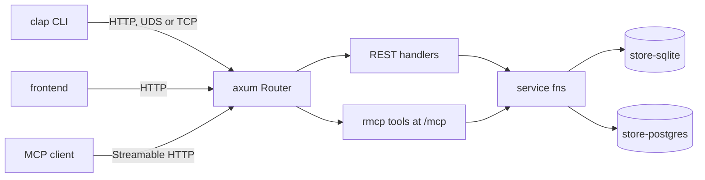
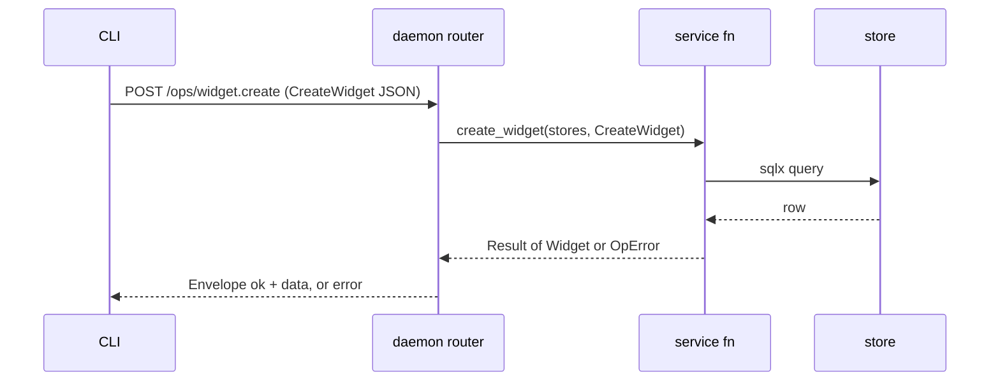
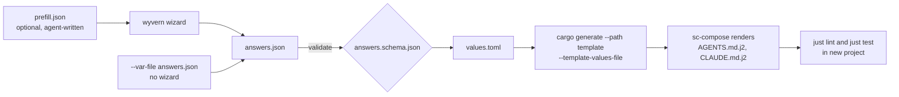

# sc-runtime — Design

Status: final input for sprint planning · 2026-09-19 · Rand Lee

Source of truth: https://claude.ai/code/artifact/c49d4a44-2689-4a31-82c3-a9056e080d41

## Summary

`sc-runtime` is a `cargo-generate` template plus four small, independently published library crates that together instantiate a working daemon: Tokio, Axum, an MCP server on the same router, a Clap CLI that talks to the daemon over HTTP, and one or two sqlx stores. A new project supplies an answers JSON file (written by hand, by an agent, or by a Wyvern wizard) and gets a compiling workspace with one example operation reachable from REST, MCP, and the CLI.

One principle shapes everything: **the framework instantiates, the project wires.** `sc-runtime` builds the parts and hands them over. What the routes do, which store they touch, and what data moves where are all project decisions made in ordinary Rust code.

The second principle is **thin template, versioned crates.** Generated code cannot be upgraded after birth; a dependency can. Anything that should improve across all projects lives in a published crate. Anything a project will want to edit lives in the template.

The third principle is **standardise below the application layer, and do it with general code, not extra requirements.** Build, test, reporting, and runtime are the same in every project; projects differ only at the application layer. A requirement or boundary belongs in this design only if it results in less code to write. Anything that would need custom code or an adapter where a standard tool already does the job is left out.

Every component is a standard, widely used crate used the documented way: `axum` 0.8, `rmcp` 3.x, `utoipa` and `utoipa-axum`, `sqlx` 0.9, `clap`, `reqwest` 0.13, `cargo-generate`. Status labels in the decision log separate what Rand stated, what is recommended, and what Phase 0 must verify.

**Status: final input for sprint planning, 19 Sep 2026.** Items marked Recommended in the decision log are assumed accepted for planning unless struck. Items marked Verify are resolved by the first sprint and must not be planned around as facts. How this design differs from the draft reviewed at the start is listed under Changes from the reviewed draft.

## Goals and non-goals

The goal is to stop hand-assembling the same stack differently per project, without the framework acquiring opinions about what a project does.

| The framework provides | The project wires |
| --- | --- |
| A daemon process with lifecycle and singleton lock; standalone crates for config, transport, and the command envelope | Its operations: service functions, routes, MCP tools, CLI commands |
| An Axum router with REST, OpenAPI, and MCP mounted on one listener | Which store each route uses, one or both |
| Configured stores, constructed and migrated, handed to the project | Schemas, queries, and any data flow between stores |
| A CLI-side HTTP client that finds the daemon and reports when it is not running | Everything at the application layer |
| Test fixtures that start an isolated daemon per test | Frontend, deployment, and release packaging |

Non-goals:

- A command registry, macro system, or code generator of its own. Standard derives and standard routers only.
- A portable query layer. Each store has a fixed backend; no query is written to run on more than one.
- Forwarding, replication, outbox, or routing policy between stores.
- SQL Server. sqlx has no MSSQL driver.
- A web-app framework. There is no templating, sessions, or user auth.
- Adopting an existing scaffold (loco-rs, rust-web-app, axum-postgres-template). None has the daemon plus thin-client split; they remain pattern references.

## Repository layout

One repo, `randlee/sc-runtime`, holds the template and, as workspace members, the four library crates. Each crate is an independent deliverable: usable on its own, with its own README, tests, and version, and published separately to crates.io. Keeping them in one workspace means template CI always tests against the crates at the same commit. Any of them can move to its own repo later without an API change.

```text
sc-runtime/
  Cargo.toml                 # workspace: crates/*, not template/
  crates/
    sc-config/               # JSON config + env overrides; standalone
    sc-transport/            # UDS/TCP listener + client connector; standalone
    sc-command/              # envelope, OpError, REST/MCP conversions; standalone
    sc-runtime/              # assembly: Daemon::builder, daemon.lock, DaemonFixture
  template/                  # cargo-generate template root
    cargo-generate.toml
    AGENTS.md.j2             # excluded from Liquid; rendered by sc-compose
    CLAUDE.md.j2
    ...                      # see Generated project
  wizard/                    # wyvern wizard; never copied into a generated project
    wizard.json
    answers.schema.json      # the options contract
    pages/                   # HTML pages + wizard-answers.js, written in the final phase
    fixtures/                # one answers JSON per tested variant
  scripts/
    new_project.py           # driver: wizard -> validate -> cargo generate -> sc-compose -> just lint, just test
    run_wizard.py            # reused from p3-nuget-template
  tests/unit/                # schema, key-set match, fail-closed fixtures
  examples/
    spike/                   # Phase 0 throwaway, deleted at v0.1.0
  docs/adr/                  # ADRs, including amendments to ADR-013
  justfile                   # includes `just new <dest>`
  .github/workflows/         # crate CI + template fixture matrix
```

Generate with `just new <dest>` from a clone of this repo, which runs the wizard and then the tools described under Template and generation flow. Without Wyvern the template alone still works: `cargo generate --git https://github.com/randlee/sc-runtime template --name my-app` prompts in the terminal, and `cargo-generate` takes the subfolder as the template root.

Generated projects depend on the crates by crates.io version. Before the first publish, and for testing unreleased changes, a git tag or a `[patch.crates-io]` entry stands in. This replaces rev 4's plan of path dependencies copied into each project, which has no upgrade path.

The CLI binary must not link Axum or sqlx. `sc-transport` and `sc-command` therefore gate their server-side parts behind a `server` feature, and `sc-runtime` is only a dependency of the daemon.

## Generated project

A generated project is a Cargo workspace of small crates. The crate boundaries exist for mechanical reasons, not style: sqlx needs one crate per database, and the CLI must not link the daemon's dependencies.

```text
my-app/
  Cargo.toml                 # workspace
  crates/
    api-types/               # request/response structs; serde + JsonSchema + ToSchema
    store-sqlite/            # if db = sqlite | both: pool, migrations/, queries, sqlx.toml, .sqlx/
    store-postgres/          # if db = postgres | both: same shape
    service/                 # async service fns; depends on api-types + store crates
    daemon/                  # main.rs, routes.rs, mcp.rs (if mcp); depends on sc-runtime, sc-config
    cli/                     # clap commands; depends on sc-transport, sc-command, sc-config, api-types
  config/                    # default.json, local.json (gitignored)
  Justfile                   # MVP: minimal placeholder with standard command names; later installed by sc-lint
  AGENTS.md
  .github/workflows/ci.yml
```

| Crate | Depends on | Why it is separate |
| --- | --- | --- |
| `api-types` | serde, schemars, utoipa | Shared by daemon and CLI so both compile against the same structs; no client codegen needed |
| `store-*` | sqlx (one driver each) | sqlx 0.9 checks queries against one database per crate |
| `service` | api-types, store crates | The single code path to SQL; called by both REST and MCP handlers |
| `daemon` | service, sc-runtime, sc-config | Owns wiring: which routes exist and what they call |
| `cli` | api-types, sc-transport, sc-command, sc-config | Thin HTTP client; never links sqlx or axum |
|  |  |  |

The template ships one example operation, `widget.create` and `widget.get`, wired end to end through all three surfaces with a test. It is the worked example a project copies and then deletes.

## Runtime architecture

One daemon process owns the stores, and every client reaches it over HTTP through one Axum router. REST handlers and MCP tools are both thin: they deserialise into an `api-types` struct and call the same async service function.



Both stores are shown; a project may have either or both, and each service function uses whichever it needs.

Stated properties, carried from the draft and rev 4:

- The daemon is always running. The CLI has no direct-DB mode; if the daemon is unreachable the CLI returns `DAEMON.NOT_RUNNING` with a suggested action.
- The daemon is the only process that opens the local database. A hard singleton is held by an OS exclusive lock on `<instance-root>/daemon.lock` (`fd-lock`).
- Everything is async end to end: handler, service function, sqlx pool.
- MCP is part of the daemon, same binary, same port, mounted with `nest_service("/mcp", ...)`.

Request path for one operation:



An MCP `tools/call` for `widget_create` takes the same path from the second step on, with the same `CreateWidget` struct as its input schema.

## The crates

Four crates, each an independent deliverable published to crates.io and usable without the others or the template. `sc-runtime` is the only one that knows about the rest; it assembles them.

| Crate | Useful on its own for | Contains | Depends on |
| --- | --- | --- | --- |
| `sc-config` | Any Rust program that needs configuration | JSON config files with environment-variable overrides, deserialised into the caller's serde types. Every public method returns a discriminated union; no panics | serde, serde\_json. No dependency on `sc-observability` |
| `sc-transport` | Any local daemon and CLI pair | Listener binding for `axum::serve` over UDS or TCP; endpoint resolution (instance root, `--endpoint`, `SC_ENDPOINT`); client connector using reqwest `unix_socket` or TCP; the typed `DAEMON.NOT_RUNNING` error&#32; | tokio, reqwest; axum only behind `server` |
| `sc-command` | Any JSON-first CLI or API following sc-ai-cli | `Envelope<T>` and `OpError`; conversions into an axum response and an rmcp `CallToolResult`&#32; | serde, `sc-observability-types`; axum and rmcp only behind `server` |
| `sc-runtime` | The assembled daemon | `Daemon::builder()`, `daemon.lock` singleton, graceful shutdown, `DaemonFixture` | the three above, axum, tokio, fd-lock |

The split between `sc-transport` and `sc-command` is a recommendation. The names were approved in rev 4 for a registry-based design; this table is what they mean under the shared-service-function model.

**sc-config requirements.** Base requirement for the first release: JSON files with environment overrides, and an API where every method returns a discriminated union, in Rust an enum such as `Result<T, ConfigError>` with a typed error enum, so there are no panics. Noted for later and out of the initial plan: automatic reloading, change notification, and async interop, possibly as a separate `sc-config-tokio` crate.

**Observability is not wrapped.** `sc-observability` and its OTel export crate stay independent of `sc-config` and of `sc-runtime`. Neither depends on the other. The generated `main.rs` reads config, then initialises `sc-observability` directly with plain values. The only observability dependency inside these crates is `sc-observability-types` in `sc-command`, for the error code and remediation types the sc-ai-cli envelope is defined on.

**sc-runtime is a bootstrap, not a framework layer.** It is the ADR-013 single assembly point, reduced to assembly only. It owns no registry of commands and wraps no Axum or rmcp type; the project passes in an ordinary router and an ordinary rmcp service. What `Daemon::builder()` does, in order:

1. Take the already-loaded config from the project.
2. Resolve the instance root and take the `daemon.lock` singleton.
3. Call the project's stores closure. Opening pools and running migrations happens inside the store crates, which are project-owned template code.
4. Merge the project's router, the OpenAPI document route, a health route, and the MCP service if one was given.
5. Bind the listener through `sc-transport` and serve with graceful shutdown on SIGINT and SIGTERM.

API sketch. Names are illustrative and are pinned in the sprint plan; the shape is the point.

```rust
// daemon/src/main.rs in a generated project
#[tokio::main]
async fn main() -> ExitCode {
    // 1. config: sc-config, no panics, errors are values
    let cfg: AppConfig = match sc_config::load("my-app") {
        Ok(cfg) => cfg,
        Err(e) => return report(e),
    };

    // 2. observability: initialised directly by the project, not wrapped
    let _obs = sc_observability::init(cfg.logging.clone());

    // 3. assembly
    let result = sc_runtime::Daemon::builder("my-app", &cfg.daemon)
        .stores(|| async { Stores::open(&cfg.stores).await })   // project-defined struct
        .routes(|stores| routes::router(stores))                // utoipa_axum::OpenApiRouter
        .mcp(|stores| mcp::service(stores))                     // optional; an rmcp service
        .run()
        .await;
    exit_code(result)
}
```

`Stores` is a plain struct defined by the project. The framework never inspects it; it only passes it to the project's own closures. That is how which route uses which store stays entirely in project code.

Client side, using `sc-transport` and `sc-command` directly, with no dependency on `sc-runtime`:

```rust
// cli/src/main.rs
let client = sc_transport::Client::connect("my-app", &cfg.endpoint).await?; // Err = DAEMON.NOT_RUNNING
let widget: Envelope<Widget> = client.post("/ops/widget.create", &CreateWidget { name }).await?;
```

`sc_runtime::testing::DaemonFixture` starts a daemon on a tempdir instance root per test so tests run in parallel.

## Transport and clients

Everything speaks HTTP; the listener underneath is a configuration choice. `axum::serve` accepts a `TcpListener` or a `UnixListener` with no change to routes.

| Setting | Default | Notes |
| --- | --- | --- |
| mac and linux | UDS at `<instance-root>/daemon.sock` | File permissions restrict access to the user. Same approach as dockerd. |
| windows | TCP on 127.0.0.1 | reqwest's `unix_socket` is Unix only |
| cross-host or frontend | TCP, port from config | Port ranges are registered centrally in the synaptic-canvas repo, per rev 4 |
| override | `--endpoint` flag or `SC_ENDPOINT` | Carried from rev 1 |

A daemon may bind both a UDS and a TCP listener at once when a browser frontend needs TCP and the CLI stays on the socket.

**CLI client.** `sc_transport::Client` builds a `reqwest::Client`, using `ClientBuilder::unix_socket(path)` for UDS or a base URL for TCP. No `hyperlocal` or custom connector is needed as of reqwest 0.13. A connection failure maps to the typed `DAEMON.NOT_RUNNING` error with `suggested_action: "run <app> daemon start"`. The CLI does not auto-start the daemon; that question is still open from rev 4 and the default is report-only.

**MCP.** rmcp's `StreamableHttpService` is a Tower service mounted with `nest_service("/mcp", svc)`. It runs in stateless mode so the template carries no session store. MCP clients that only speak stdio are out of scope for v0; a stdio-to-HTTP shim is a later option if one is needed.

**Frontend.** Any HTTP client. The daemon serves `openapi.json`, from which a TypeScript client can be generated by whichever generator the frontend project prefers. The template does not pick one.

## Stores

A store is one crate bound to one backend, with its own pool, migrations, and compile-time-checked queries. A project has one or two. The framework constructs nothing here itself; the store crates are template code the project owns.

Why one crate per backend: sqlx's `query!` macros check each query against a live or cached schema for one database, and sqlx 0.9 states that a separate crate is required per database. Its `sqlx.toml` lets each crate name its own URL variable so both build in one workspace.

|  | `store-sqlite` | `store-postgres` |
| --- | --- | --- |
| sqlx feature | `sqlite` | `postgres` |
| URL variable (`sqlx.toml`) | `SQLITE_DATABASE_URL` | `POSTGRES_DATABASE_URL` |
| Migrations | `migrations/`, embedded with `sqlx::migrate!` | same |
| Offline data | `.sqlx/` checked in, via `just db-prepare` | same |
| Default pool shape | read pool (N connections) plus a 1-connection write pool, WAL on | single pool |
| Typical role in SC projects | fast local traffic | shared aggregate across hosts |

Each store crate exposes `open(cfg) -> Result<Store>` and typed query functions. `service` calls those functions; nothing else touches sqlx.

**SQLite writes.** SQLite allows one writer at a time. The template default is the standard sqlx arrangement: many readers, one write connection. It is correct under concurrency with no custom code. atm-core's batched write actor (mpsc in, oneshot replies, coalesced transactions, 44k messages per second) is the known upgrade when a project measures write contention. It is listed under opt-in facilities and is not part of v0.

**Backends.** Confirmed scope is unchanged from the draft: SQLite, Postgres, and MySQL. They arrive in that order. v0.1 ships `store-sqlite`, v0.2 adds `store-postgres` and the `both` option, and `store-mysql` follows the same shape when the first project needs it. SQL Server stays out.

## API surface

An operation is defined once as a pair of `api-types` structs and one service function. REST, MCP, and the CLI are three thin views of it, each produced by a standard derive or macro.

```rust
// api-types
#[derive(Serialize, Deserialize, JsonSchema, ToSchema)]
pub struct CreateWidget { pub name: String }

// service
pub async fn create_widget(s: &Stores, input: CreateWidget) -> Result<Widget, OpError> { ... }

// daemon/routes.rs: utoipa path + axum handler
#[utoipa::path(post, path = "/ops/widget.create", request_body = CreateWidget, responses(...))]
async fn create_widget(State(s): State<Stores>, Json(input): Json<CreateWidget>) -> Envelope<Widget> {
    service::create_widget(&s, input).await.into()
}

// daemon/mcp.rs: rmcp tool
#[tool(description = "Create a widget")]
async fn widget_create(&self, Parameters(input): Parameters<CreateWidget>) -> Result<CallToolResult, McpError> {
    service::create_widget(&self.stores, input).await.into_mcp()
}
```

| Surface | Produced by | Schema source |
| --- | --- | --- |
| REST routes and `openapi.json` | `utoipa-axum` `OpenApiRouter` with `routes!`; one registration yields both router and spec | `ToSchema` on api-types |
| MCP tools | rmcp `#[tool]` and `#[tool_router]` | `JsonSchema` on the same api-types struct |
| CLI | clap derive; each command builds the api-types struct and calls the client | the struct itself, shared at compile time |

**One struct by default, not by rule.** The template example derives both `JsonSchema` and `ToSchema` on one api-types struct, which satisfies the sc-ai-cli no-reshaping convention and makes the `utoipa` versus `aide` question moot. The draft's allowance still holds: a project may give MCP and REST different JSON shapes at the edge, provided both convert to the same service-function input before anything reaches SQL. Nothing in `sc-runtime` enforces either choice.

**Envelope.** Responses use the sc-ai-cli envelope `{version, ok, data, error}` with a typed `OpError` (`kind`, `code`, `message`, `details`, `suggested_action`), backed by `sc_observability_types`. `sc-command` supplies the `Envelope<T>` response type and the `into()` and `into_mcp()` conversions. The CLI's `--json` prints the envelope unchanged.

**Route convention.** The example uses rev 4's `POST /ops/{name}`. A project may use any route shape; nothing in `sc-runtime` depends on it.

**No generated Rust client.** `progenitor` reads OpenAPI 3.0.x and `utoipa` 5 emits 3.1.0, so that chain does not connect today. Inside one workspace the shared `api-types` crate gives the same type safety with no generator.

## Template and generation flow

Generation is driven by one answers JSON file and two existing tools: `cargo-generate` renders the Rust workspace, and `sc-compose` renders the agent-facing Jinja documents. The pipeline follows the one proven in `p3-nuget-template`, with `cargo-generate` taking the place of that repo's custom deploy-and-render engine.



The three entry modes are carried over from `p3-nuget-template` unchanged: interactive wizard, `--prefill` (an agent guesses, the human reviews in the wizard), and `--var-file` (fully non-interactive, used by CI and agents).

**The contract is `answers.schema.json`.** It is the single definition of every option: names, types, defaults, enums, and conditional requirements. The wizard emits an object of that shape, the driver validates against it, and the placeholders in `cargo-generate.toml` use the same names. A unit test asserts the two key sets match, so the wizard and the template cannot drift.

**Wizard.** A deliverable of this project, built in the final sprint. At generate time it is the default way a person supplies settings; `--var-file` is the alternative for agents, CI, and repeat runs. Both produce the same answers JSON, so nothing else in the design depends on which one was used.

It is made by copying a working example and editing its fields and lists to match the schema as it then stands. The reference example:

| What | Where |
| --- | --- |
| Repo | [Radiant-Vision-Systems/p3-nuget-template](https://github.com/Radiant-Vision-Systems/p3-nuget-template) (private), read at commit `9ef4d03` |
| Local clone | `/Volumes/Extreme Pro/github-radiant/p3-nuget-template` |
| Wizard descriptor | `.scaffold/wizard/wizard.json` |
| Pages and shared helper | `.scaffold/wizard/pages/*.html`, `pages/wizard-answers.js`, `pages/wizard-page.css` |
| Answers contract | `.scaffold/wizard/answers.schema.json` |
| Runner (wyvern invocation, prefill, validation) | `.scaffold/scripts/run_wizard.py` |
| Answers fixtures | `.scaffold/tests/fixtures/*.json` |

**Rendering with cargo-generate.** The template under `template/` is a standard `cargo-generate` template. The driver writes the validated answers as a `[values]` TOML file and runs `cargo generate --path template --template-values-file values.toml --name <project>`. `cargo-generate` supports `string`, `bool`, and `array` placeholders, which covers the options above. Conditional `ignore` lists in `cargo-generate.toml` include or exclude whole files, such as `crates/store-postgres` or `daemon/src/mcp.rs`. Liquid stays out of Rust logic; the few in-file differences (the `Stores` struct, the `.mcp(...)` line) are kept under ten lines total.

Because the placeholders carry their own prompts and defaults, plain `cargo generate` still works for anyone without Wyvern. It is the same template tree, only with terminal prompts.

**Rendering with sc-compose.** `AGENTS.md.j2` and `CLAUDE.md.j2` stay validated Jinja with frontmatter, matching p3 and the sc-ai-cli templates. Liquid and Jinja both use `{{ }}`, so these files are listed under `exclude` in `cargo-generate.toml`, which copies them without rendering. The driver then runs `sc-compose` on them with the same answers and removes the `.j2` sources.

**Driver.** A small script, `scripts/new_project.py`, reusing `run_wizard.py` from p3 nearly verbatim, since that file is already schema-driven. It finds `wyvern` and `sc-compose` through `$WYVERN_BIN` and `$SC_COMPOSE` or `PATH`, merges prefill into `config.prefill`, runs the wizard, validates, writes `values.toml`, calls `cargo generate`, calls `sc-compose`, and runs `just lint and just test` in the result. Exposed as `just new <dest>`. The wizard and driver live beside `template/`, not inside it, so nothing needs deleting from the generated project.

**Template CI.** A fixture matrix as in p3: `wizard/fixtures/*.json` holds one answers file per variant. CI runs the driver with `--var-file` for each fixture, then `just lint and just test` inside the result, with a Postgres service container for fixtures that need one. Unit tests cover the schema, the key-set match, and invalid fixtures failing closed. Wyvern itself is not needed in CI.

## Ideas not in the plan

None of these is a requirement and none is in the build plan. Each would add code, so each waits until a project asks for it. They are recorded so the sprint plan can leave them out deliberately.

| Idea | Origin | Note |
| --- | --- | --- |
| SQLite batched write actor | Draft §2 and §6, atm-core prior art | Ported from atm-core when a project measures write contention; SQLite-specific |
| `tracing` bridge into `sc-observability` | Open since rev 2 | Whether a bridge is acceptable is still undecided |
| CLI auto-starts the daemon | Open since rev 4 | Default is report-only with `DAEMON.NOT_RUNNING` |
| OTel export | rev 1 | A project adds the OTel export crate itself; nothing here wraps it |
| Bearer token for TCP listeners; Origin and Host checks on `/mcp` | Raised in this design | Relevant only when a daemon listens on TCP. UDS with file permissions is the default and needs neither |
| Surface snapshots of `openapi.json`, MCP `tools/list`, and the clap model | Raised in this design | Superseded: see below |

Adapter-drift enforcement, a rev 4 goal, is not rebuilt as custom tooling in this repo. Keeping REST, MCP, and CLI in step is a lint concern, so it belongs in sc-lint and reaches projects through the standard sc-lint setup. Crate-boundary enforcement arrives the same way.

## Standard just system and sc-lint

Every SC repo exposes the same base `just` commands, and for Rust repos those commands run a standardised sc-lint setup. That infrastructure is owned and installed by sc-lint, not by this template. The generator's whole involvement is one call after generation, of the form `sc-lint create --vars answers.json`, the exact command being sc-lint's to define. sc-lint reads the same answers JSON the project was generated from and installs the matching `just` and sc-lint infrastructure.

The order is inverted from a template-first approach:

1. The MVP generator produces a prototype set of example repos, one per meaningful combination of options.
2. The sc-lint team uses those repos as the reference and builds sc-lint install packages for the generator's option space.
3. The driver gains one step: call sc-lint with the answers JSON. The template carries no lint configuration, boundary rules, or `just` modules of its own.

This keeps `sc-runtime` free of lint knowledge. When sc-lint's rules or the standard `just` system change, generated projects pick that up from sc-lint, and nothing in this repo changes.

Until step 3 exists, the template ships a minimal placeholder `Justfile` that uses the standard base command names, `just lint` and `just test`, so prototype repos build and test and CI has stable gates. `sc-lint create` replaces that file; the command names do not change, so no workflow or document does either.

The interface between the two projects is only the answers JSON and its schema. `answers.schema.json` is therefore a published, versioned contract that sc-lint also consumes.

The inversion changes the question. It is no longer how this template gets the current sc-lint crates to work; it is what should change in sc-lint so that installing into a generated project is trivial. That question belongs to the sc-lint project and is answered there. What `sc-runtime` hands over is three things it already produces: the answers schema, the answers fixtures, and the prototype repos generated from them. This design sets no requirements on how sc-lint does it.

## Changes from the reviewed draft

Every confirmed decision in section 2 of the draft is carried unchanged. The differences are three substitutions in the researched-but-unconfirmed tooling, one resolution of the draft's own open tension, and material the draft did not cover.

| Draft item | In this design | Kind |
| --- | --- | --- |
| §1 Purpose: reusable template and crate set; Tokio, Axum, MCP on Axum, Clap CLI, SQL | Same | Unchanged |
| §1 Backends: Postgres, MySQL, SQLite; no SQL Server | Same scope, delivered SQLite, then Postgres, then MySQL | Unchanged, sequenced |
| §2 Daemon always running; no CLI bypass; `DAEMON.NOT_RUNNING` | Same | Unchanged |
| §2 Daemon owns SQL via sqlx, sole writer | Same for the local store. A shared Postgres store may be written by daemons on several hosts, per the multi-host aggregation use stated in review | Unchanged, clarified |
| §2 Everything connects over HTTP | Same | Unchanged |
| §2 MCP inside the daemon via rmcp `StreamableHttpService`, `nest_service("/mcp")`, same port | Same, stateless mode | Unchanged |
| §2 Edge JSON may differ; both resolve to the same struct and one shared async service function | Same. The template example uses one struct; divergence stays allowed | Unchanged |
| §2 Async end to end; `sqlx::Pool` | Same | Unchanged |
| §2 SQLite single-writer; atm-core batched write actor as prior art | Acknowledged. Default is a read pool plus a one-connection write pool; the actor is ported from atm-core when a project needs it | Deferred, not dropped |
| §3 `utoipa` for OpenAPI | Same, with `utoipa-axum` | Unchanged |
| §3 `progenitor` generates the CLI client | Replaced by a shared `api-types` crate and a thin client in `sc-runtime`. progenitor reads OpenAPI 3.0.x; utoipa 5 emits 3.1.0 | **Changed** |
| §3 rmcp with schemars tool schemas | Same; `mcpkit-axum` evaluated and not adopted | Unchanged |
| §3 Listener-agnostic `serve()`, UDS or TCP | Same | Unchanged |
| §3 CLI over UDS needs `hyperlocal` or a custom connector | reqwest 0.13 `ClientBuilder::unix_socket`; no extra crate | **Changed** (fact correction) |
| §4 Build, do not adopt; SQL Server cut | Same conclusions | Unchanged |
| §5 Registry with three generated adapters versus shared service functions | Shared service functions. ADR-013's assembly point survives as `sc_runtime::Daemon::builder()`, assembly only | **Resolved** as the draft leaned |
| §5 sc-lint adapter-drift rule | Not rebuilt as custom tooling here. Keeping the three surfaces in step is a lint concern, so it is left to sc-lint and reaches projects through the standard sc-lint setup after the MVP | **Changed**; moved to sc-lint, no new code in this repo |
| §6 Q1, Q2 write-actor generalisation | Deferred; SQLite-specific when it arrives | Answered |
| §6 Q3 crate packaging | The three approved crates survive as independent crates published to crates.io, redefined for the service-function model, with `sc-runtime` as the assembly crate | Answered in review; matches rev 4's crate names |
| §6 Q4 frontend client generation | Daemon serves `openapi.json`; generator choice left to the frontend project | Left open on purpose |
| §6 Q5 utoipa versus aide | utoipa | Answered |

Added during review, absent from the draft:

- The template principle: the framework instantiates, the project wires; few rules. Stated in review.
- One store crate per backend, with SQLite plus Postgres as a common pairing and routes deciding which store they use. Stated in review; the crate-per-backend mechanics follow from sqlx 0.9.
- The split into released crates linked by generated apps plus a `cargo-generate` template, in one repo. Confirmed reasonable in review, then refined: `sc-config`, `sc-transport`, and `sc-command` are independent crates.io deliverables, and `sc-runtime` assembles them.
- Generation driven by an answers JSON file validated against a schema, rendered by `cargo-generate` and `sc-compose`, with a Wyvern wizard as the last sprint. Stated in review.
- Ideas raised here that are not in the draft: TCP bearer token and `/mcp` origin check. They are ideas only and are not in the build plan.
- Carried in from rev 2 to 4 because the draft was silent on them: `sc-observability`, the sc-ai-cli envelope, `daemon.lock`, `DaemonFixture`, `just`, the central port registry.

One rev 4 decision is amended, not just the draft: reusable crates were to start as path dependencies inside the template and be extracted in a later phase. This design builds them as separate workspace crates from the start and has generated projects depend on published versions, since a path dependency copied into each project cannot be upgraded.

## Decision log

Every decision this design rests on, with who made it. "Stated" means Rand said it in the draft, rev 4, or this review. "Recommended" means this design proposes it and it needs a yes or no. "Verify" means Phase 0 must confirm it before it is relied on.

| # | Decision | Status |
| --- | --- | --- |
| 1 | Daemon always running; no direct-DB CLI mode; `DAEMON.NOT_RUNNING` | Stated (ADR-014) |
| 2 | Daemon owns SQL via sqlx; sole writer of the local store; `daemon.lock` singleton | Stated |
| 3 | All clients use HTTP; MCP mounted in the daemon's router via rmcp | Stated |
| 4 | One code path to SQL through shared async service functions | Stated |
| 5 | Prefer standard designs over hand-rolled pieces | Stated |
| 6 | It is a template: the framework instantiates, the project wires routes, stores, and data flow | Stated |
| 7 | Projects commonly have SQLite plus Postgres with different schemas and roles | Stated |
| 8 | `just` only; `sc-observability` 1.2.x; sc-ai-cli envelope; central port registry; `DaemonFixture` | Stated (rev 2 to 4), carried unchanged |
| 9 | SQL Server out of scope | Stated |
| 10 | Shared service functions replace the typed command registry; ADR-013's assembly point becomes `sc_runtime::Daemon::builder()` | Recommended; amends ADR-013 |
| 11 | `sc-config`, `sc-transport`, and `sc-command` are written as independent deliverables, each usable on its own and published to crates.io; `sc-runtime` assembles them | Stated. None of the three exist as code yet. What goes in `sc-transport` versus `sc-command` is recommended |
| 12 | One store crate per backend; no portable queries | Recommended; forced by sqlx 0.9 if checked queries are kept |
| 13 | Template example uses one api-types struct for REST, MCP, and CLI; edge shapes may differ in a project as long as both convert to the same service input | Recommended default; consistent with the draft |
| 14 | No progenitor; shared `api-types` crate instead | Recommended |
| 15 | `rmcp`, not `mcpkit-axum` | Recommended |
| 16 | Crates and template in one repo as a workspace; crates published separately to crates.io; generated projects depend on crates.io versions | Recommended; replaces path deps then Phase 4 extraction |
| 17 | Adapter-drift enforcement is left to sc-lint and the standard sc-lint setup; no custom snapshot tooling in this repo | Recommended; follows the less-code principle |
| 18 | MCP stateless mode | Recommended; matches rev 1 |
| 19 | rmcp 3.x, utoipa-axum 0.2, and axum 0.8 coexist on one router without version conflicts | Verify |
| 20 | rmcp `Parameters<T>` accepts a struct that also derives `ToSchema` with no schema clashes | Verify |
| 21 | MCP `tools/list` dump for snapshots: no longer needed, snapshot tooling was dropped | Verify |
| 22 | `cargo-generate.toml` conditional ignore, exclude, and placeholder syntax on the current release | Verify |
| 23 | `tracing` bridge into `sc-observability` is acceptable | Open since rev 2 |
| 24 | CLI auto-starts the daemon, or reports only | Open since rev 4; default report-only |

Added 19 Sep 2026, after reviewing `p3-nuget-template`:

| # | Decision | Status |
| --- | --- | --- |
| 25 | Options are collected with a Wyvern wizard, built the way the p3-nuget-template wizard is | Stated |
| 26 | Use the appropriate tool for each job: cargo tools where applicable, sc-compose for validated Jinja, Wyvern for the options UI | Stated |
| 27 | `answers.schema.json` is the single options contract; `cargo-generate.toml` placeholders mirror its keys, checked by a unit test | Recommended |
| 28 | Rust workspace rendered by `cargo-generate` from a values file; `AGENTS.md.j2` and `CLAUDE.md.j2` excluded from Liquid and rendered by `sc-compose` | Recommended |
| 29 | Driver is a Python script reusing p3's `run_wizard.py`; a Rust binary can replace it later if Python becomes unwelcome as a prerequisite | Recommended |
| 30 | Template CI uses an answers-fixture matrix through `--var-file`, replacing the `cargo-generate-action` matrix | Recommended |
| 31 | `cargo generate` runs fully non-interactive with `--template-values-file` and `--silent`, including `array` values, and `exclude` copies `.j2` files untouched | Verify |

Added 19 Sep 2026, crates and tooling:

| # | Decision | Status |
| --- | --- | --- |
| 32 | `sc-config` base requirements: JSON with environment overrides; every method returns a discriminated union; no panics | Stated |
| 33 | `sc-config` later: auto-reload, change notification, async interop, possibly `sc-config-tokio`. A note only, not in the initial plan | Stated |
| 34 | `sc-observability` and its OTel export crate are independent of config and are not wrapped; the generated `main.rs` initialises them directly | Stated |
| 35 | All repos share a standardised `just` system with the same base commands; Rust repos use a standardised sc-lint setup behind it. The sc-lint repo is the source of truth | Stated |
| 36 | sc-lint support is inverted: once prototype repos exist, the sc-lint team builds install packages for the generator; the generator then only calls sc-lint with the answers JSON (`sc-lint create --vars <json>` or similar), and sc-lint installs the `just` and sc-lint infrastructure for those options | Stated |
| 37 | Until that command exists, the template ships a minimal placeholder `Justfile` with the standard base command names so `just lint` and `just test` are stable gates | Recommended |
| 38 | Standardise build, test, reporting, and runtime; differences occur only at the application layer. Achieved with general standardised code, not added requirements that need custom code or adapters. Requirements must result in less code, not more | Stated |
| 39 | `answers.schema.json` is a versioned contract consumed by sc-lint as well as by the generator | Recommended; follows from 36 |

## Build plan

Five phases to the MVP, about 3 agent-days plus an hour or two for the wizard. Everything through v0.1.0 is driven by an answers JSON file; the wizard is a short final sprint that produces the same file, so nothing before it depends on it.

| Phase | Output | Exit gate | Estimate |
| --- | --- | --- | --- |
| 0. Spike | `examples/spike`: one binary with axum, utoipa-axum, rmcp stateless mount, sqlx SQLite, UDS listener; a clap client using `unix_socket` | `curl --unix-socket`, the CLI, and an MCP client all reach one service function. Decisions 19 to 22 and 31 answered. Version pins recorded. ADR amendments written and accepted. | 0.5 day |
| 1. Crates | `sc-config`, `sc-transport`, `sc-command`, `sc-runtime`, each standalone with its own README, tests, and crates.io metadata | Each crate builds and tests alone. Spike rewritten on them; its `main.rs` is under 30 lines. Parallel `DaemonFixture` tests pass. | 1.5 days |
| 2. Template from JSON | `template/` with the widget example, the standard `just` base commands, AGENTS.md; `answers.schema.json`; answers fixtures; driver script with `--var-file` only | `just new <dest> --var-file fixtures/sqlite-mcp.json` produces a project where `just lint` and `just test` are green with no edits | 0.5 day |
| 3. Release | Fixture-matrix CI; crates published to crates.io; tag v0.1.0 | Matrix green against the published crate versions | 0.5 day |
| 4. Wizard | `wizard.json` and pages copied from an existing Wyvern wizard example with fields and lists edited to match the final schema; `--prefill`; driver runs the wizard when no `--var-file` is given | Wizard output validates against the schema and generates the same project as the equivalent fixture | 1 to 2 hours |

Phase 4 can slip or be reshaped without touching anything else. New options are added to the schema and template first, and reach the wizard as a page edit afterwards.

After the MVP, in order:

1. Generate the prototype set of example repos and hand them to the sc-lint team as the reference for its install packages.
2. When sc-lint's create command exists: add the one driver step that calls it with the answers JSON, and delete the placeholder `Justfile` from the template.
3. `store-postgres` and the `both` option, with a Postgres service container in template CI.
4. Update the sc-ai-cli Rust `.j2` templates to match.
5. `sc-config` follow-ons when needed: reload, notification, async interop.
6. Stretch, unchanged from rev 4: migrate atm-core onto these crates, which is also when its write actor would be ported back.

Risks worth naming: rmcp releases often (five versions in the 30 days to 15 Sep 2026), so the crate pins a minor version and template CI catches breakage; and the `tracing` bridge decision gates how much daemon-internal logging v0.1 shows.

## Sources

External pages were opened on 18 Sep 2026. SC decisions come from the rev 1 to 4 scaffold notes and the draft proposal. The critique behind this design is in [sc-runtime — Critical Review & Fast Plan](https://claude.ai/code/artifact/7177cb41-7503-48b0-aa92-7192d1e4332f).

- [rmcp official Rust SDK](https://github.com/modelcontextprotocol/rust-sdk) and [rmcp on crates.io](https://crates.io/crates/rmcp) (3.4.0, Streamable HTTP as a Tower service, spec 2026-07-28)
- [mcpkit-axum docs](https://docs.rs/mcpkit-axum/latest/mcpkit_axum/) and [mcpkit SDK comparison](https://github.com/praxiomlabs/mcpkit/blob/main/docs/comparison.md)
- [sqlx `query!` docs, 0.9.0](https://docs.rs/sqlx/latest/sqlx/macro.query.html) (one crate per database, `sqlx.toml` URL variable, offline mode)
- [reqwest ClientBuilder, 0.13.5](https://docs.rs/reqwest/latest/reqwest/struct.ClientBuilder.html) (`unix_socket`)
- [utoipa-axum docs, 0.2.0](https://docs.rs/utoipa-axum/latest/utoipa_axum/) and [utoipa issue 1130](https://github.com/juhaku/utoipa/issues/1130) (OpenAPI 3.1.0 output)
- [progenitor README](https://github.com/oxidecomputer/progenitor) (OpenAPI 3.0.x only)
- [cargo-generate book](https://cargo-generate.github.io/cargo-generate/), [templates](https://cargo-generate.github.io/cargo-generate/templates/index.html), [hooks](https://cargo-generate.github.io/cargo-generate/templates/scripting.html)

* `p3-nuget-template` (local clone, read 19 Sep 2026): `README.md`, `run-template.py`, `.scaffold/wizard/wizard.json`, `answers.schema.json`, `pages/wizard-answers.js`, `pages/page-3-options.html`, `.scaffold/scripts/run_wizard.py`, `bootstrap_new_repo.py`, `provision_repo.py`
* [cargo-generate template-defined placeholders](https://cargo-generate.github.io/cargo-generate/templates/template_defined_placeholders.html) (`string`, `bool`, `array` types; `--define`, `--template-values-file`)
